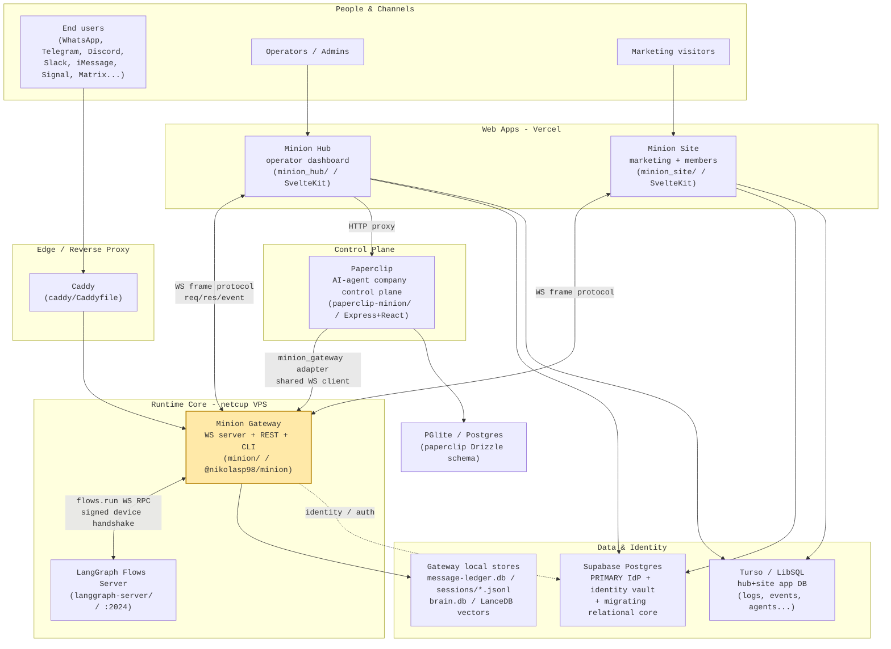
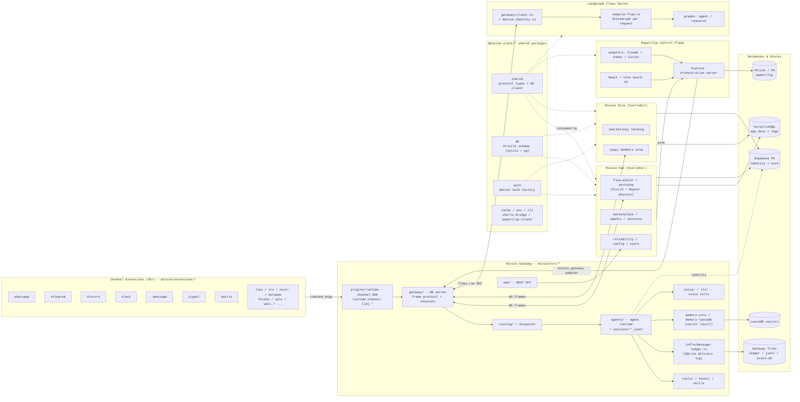
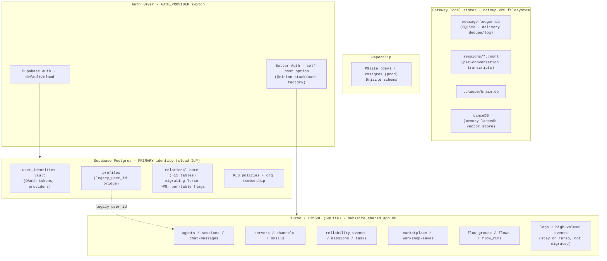
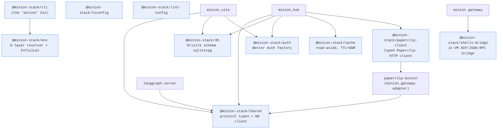
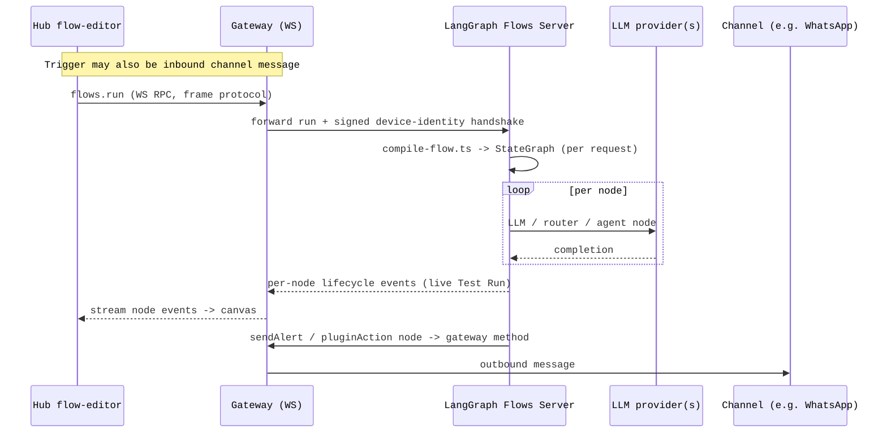
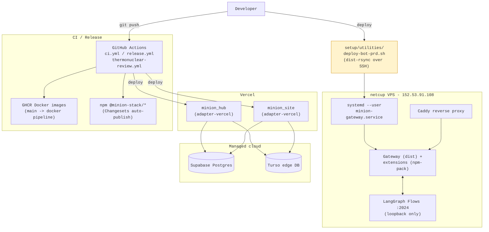

# Minion - Solution Architecture

> Generated 2026-05-29. Grounded against the live meta-repo (`packages/`, `minion/`, `minion_hub/`, `minion_site/`, `paperclip-minion/`, `langgraph-server/`, `supabase/`) and recent project memory.
> Diagrams are Mermaid - they render in Obsidian and GitHub. Open this file in Obsidian preview for the best view.

The Minion platform is a **self-hosted multi-channel AI gateway** wrapped in a meta-repo of independent subprojects bound together by shared `@minion-stack/*` packages. The **gateway** is the runtime core; everything else is a frontend, a control plane, an execution engine, or shared library code.

---

## 1. System Context - how the pieces fit

**Reading it:** every frontend talks to the gateway over the **same custom WebSocket frame protocol** (`req` / `res` / `event`), whose types live in `@minion-stack/shared`. The gateway is the only thing channels touch. Identity is consolidating on **Supabase Postgres** (primary IdP); per-tenant app data still lives in **Turso**; the gateway keeps its own **flat-file/SQLite stores** on the VPS.

---

## 2. Component & Integration Map - the detailed view

---

## 3. Data & Identity Layer - what lives where

The data story is mid-**strangler-fig migration**: identity is moving Turso -> Supabase Postgres; app/log data stays on Turso; the gateway is deliberately file-based for portability.

**Key facts**
- **Schema source of truth:** `@minion-stack/db` holds Drizzle schema for *both* SQLite (`src/schema/`) and Postgres (`src/pg/`) - hub & site import it; the dual schema is what enables the Turso->PG migration.
- **Hub local dev** points `.env` at **prod Turso**, but `.env.local` (`file:./data/minion_hub.db`) overrides it, so the dev server actually runs a **local SQLite file**. Schema is hand-managed via `CREATE TABLE IF NOT EXISTS` - never `drizzle-kit push` against prod.
- **Gateway state never touches Turso/Supabase** for message content - it's flat files + SQLite on the VPS, which is why recon work reads `message-ledger.db` and `sessions/*.jsonl` directly.

---

## 4. Shared Packages - the dependency spine

Published to npm under `@minion-stack`, independent semver via Changesets. The `minion` CLI orchestrates every subproject with the **6-layer env merge** (defaults -> Infisical shared -> sub defaults -> Infisical sub -> `.env.local` -> `process.env`).

---

## 5. Flow Execution - how a flow-editor graph runs

Flows are shipped as a **gateway plugin**; plugins can also contribute **flow templates** and **channel-scoped trigger nodes** (e.g. whatsapp/telegram "message" triggers). The router node supports **per-branch descriptions** for rubric-based LLM classification (e.g. alert-watcher's 4-level severity routing). The Flows server **binds to loopback** (`FLOWS_HOST ?? 127.0.0.1`) - only the gateway reaches it.

---

## 6. Deployment & Infrastructure Topology

> (!) **Deploy gotcha:** the netcup `deploy-bot-prd.sh` path is **dist-only** - it does *not* ship `extensions/`. New/changed channel extensions need an npm-pack step before activating on prod (skew rule from deploy memory). The gateway also has a separate `main -> GHCR` Docker pipeline; the two are distinct.

---

## Subproject <-> Role quick reference

| Subproject | Role in the solution | Talks to |
|---|---|---|
| `minion/` | **Gateway core** - WS server, channels, agents, tools, plugin SDK | channels, hub, site, paperclip, flows, local stores |
| `minion_hub/` | Operator **dashboard** - flows, workshop, marketplace, reliability | gateway (WS), paperclip (HTTP), Turso + Supabase |
| `minion_site/` | **Marketing + members** area | gateway (WS), Turso + Supabase |
| `paperclip-minion/` | **Control plane** for AI-agent companies | gateway (adapter), own PG, hub (HTTP client) |
| `langgraph-server/` | **Flow execution** engine (StateGraph compiler) | gateway only (loopback, signed handshake), LLMs |
| `packages/*` | **Shared spine** - protocol, DB schema, auth, cache, env, CLI | consumed by all above |
| `pixel-agents/` | VS Code extension (pixel office for Claude agents) | local Claude Code JSONL transcripts (standalone) |
| `docs/` | Agent registry (1,350+ defs), profiles, sprints | feeds hub marketplace + gateway runtime |

---

### Notes on accuracy
- Grounded against the working tree on 2026-05-29; the identity/DB migration is **in progress**, so the Supabase <-> Turso boundary will keep shifting per-table.
- `langgraph-server/`, `@minion-stack/cache`, `shells-bridge`, and `paperclip-client` are **newer than the root `CLAUDE.md` project map** and are reflected here from the live tree.
- I'm confident about the component topology and protocol; exact per-table migration status (which of the ~15 relational tables are already on PG vs still Turso) changes frequently - verify against `packages/db/src/pg/` flags before relying on it.
