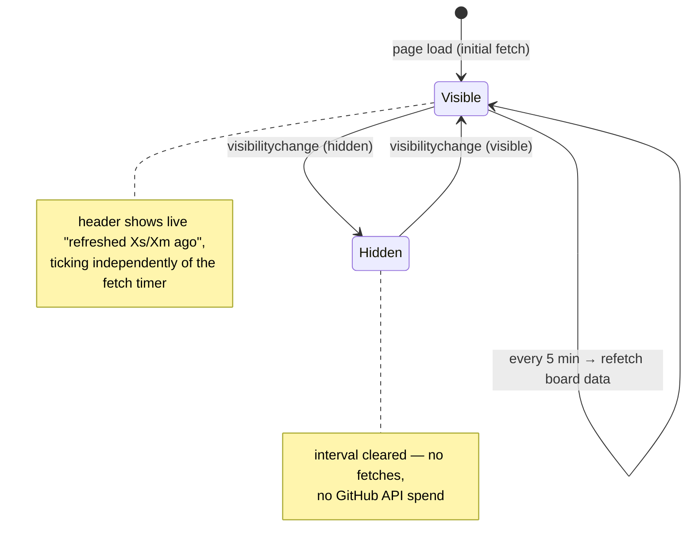

# Kanban board auto-refresh on a 5-minute visible-tab interval

## Problem

In the user's words:

> "the kanban board only refreshes on page load. I want it to auto-refresh its data every
> 5 minutes while the tab is visible (pause when hidden), and show the refreshed-ago time
> updating live."

The /kanban board derives entirely from live GitHub state (open issues, PRs, workflow runs
— see `specs/2026-08-12-minion-base-v2-sdlc-kanban-spec.md` §1 "Kanban derivation"), but
that fan-out only happens in the server `load` on navigation. A board left open on a second
monitor silently goes stale, and there is no indication of *how* stale it is.

## Motivation

The board is meant to mirror reality. A pipeline view that quietly drifts from GitHub is
worse than no view — you make decisions off a snapshot without knowing its age. Two small
changes fix it: refetch on a timer, and always show the age of what's on screen.

Pausing while hidden matters because the load fans out across every tracked repo against
the GitHub API; background tabs should not burn rate limit for a board nobody is looking at.

## Sketch

Two independent timers, both scoped to the board component and both torn down on destroy:

- **refresh timer** — 5 min, triggers the data refetch (SvelteKit `invalidate`/`invalidateAll`
  on the kanban load), only running while `document.visibilityState === 'visible'`.
- **display timer** — short tick (~1s–15s, implementer's call) that only re-renders the
  relative "refreshed N ago" label from a stored last-success timestamp. No fetching.

The refreshed-ago label lives in the existing board header alongside the repo filter chips,
styled with existing semantic tokens from `src/lib/design/tokens.css` — no raw values.

**Worth flagging for the spec stage** (does not change the requirements above): the kanban
server `load` sets `s-maxage=300`, so a 5-minute client interval sitting on a 5-minute CDN
cache can land on a cached response and appear to refresh without new data. The spec should
decide how to handle this — cache-bust the refetch, shorten `s-maxage`, or accept it — and
the "last refreshed" timestamp should reflect when the data was actually produced, not just
when the request returned.

## Out of scope

- Any repo other than `minion-base`; any route other than the kanban board.
- Configurable/user-settable interval, or a manual refresh button.
- Websockets, SSE, GitHub webhooks, or any push-based liveness.
- Persisting refresh state across navigations or reloads.
- Diffing/animating what changed between refreshes; toasts or notifications.
- Changing what the board derives or how columns are computed.

## Definition of done

- Board data re-fetches on a 5-minute interval **only** while the document is visible;
  hiding the tab stops the interval, and returning to it resumes refreshing.
- The board header shows a live relative refreshed time that updates on screen without a
  refetch (it visibly ages while you watch).
- Timers are cleared on component destroy — no leaks, no fetches after leaving the board.
- `bun run lint:design` passes with design debt unchanged (0).
- `bunx svelte-check` passes clean.
