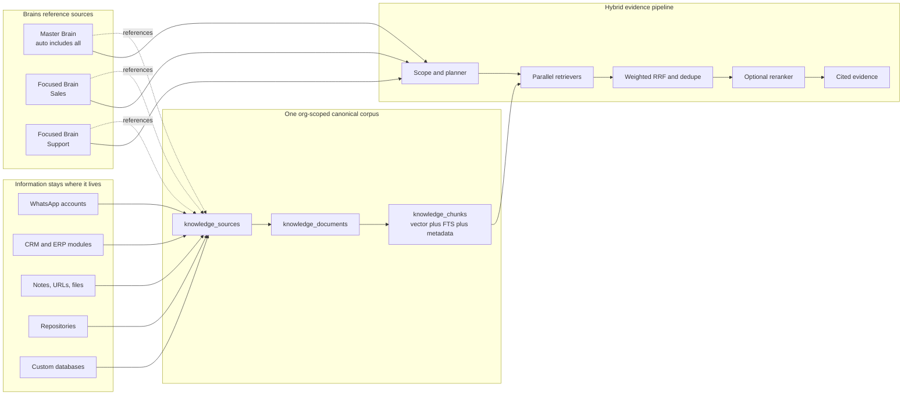

# Unified Brains Knowledge Architecture

**Date:** 2026-07-21  
**Status:** Accepted for implementation  
**Scope:** `minion_hub/` `/brains`, Hub Postgres/pgvector, Gateway brain tools  
**Primary reference:** Cerebras, “How We Built Our Knowledge Base” (2026-07-15)  
**Decision owner:** Nikolas Piñón

## 1. Decision

Minion will make `/brains` the single org-scoped knowledge plane for embedded and
searchable business data.

Every organization receives:

1. exactly one **Master Brain**, which automatically searches every knowledge source
   the organization is permitted to index; and
2. zero or more **Focused Brains**, which search named subsets of the same sources
   without copying their documents, chunks, or embeddings.

Data is ingested once into a normalized org corpus and composed into brains by
references. A source can belong to the Master Brain and many Focused Brains while its
embedding is stored once.

The first production connector is the existing message ledger, beginning with
WhatsApp 1:1 conversations. Instagram and Telegram use the same connector contract.
Notes, URLs, uploads, module snapshots, code, Slack, documents, and custom databases
follow the same source/document/chunk interface.



## 2. Why the current architecture must change

The existing Brains subsystem already provides valuable foundations:

- org-scoped RLS through `withOrgCore`;
- `brains`, `brain_documents`, `brain_chunks`, and `brain_access`;
- HNSW cosine search over 1,536-dimensional `text-embedding-3-small` vectors;
- durable `brain_ingest` background jobs;
- note, URL, upload, and three `module_ref` renderers;
- per-brain Hub and Gateway search APIs.

Its core ownership relationship is wrong for the desired product. `brain_documents`
and `brain_chunks` both carry a required `brain_id`. The same source placed in Master,
Sales, and Support brains therefore requires three physical copies and three embedding
charges. Search is vector-only, chunks are fixed character windows, source refresh is
mostly manual, and there is no first-class source registry or synchronization state.

The existing CRM conversation vectorizer solves a different slice in separate tables
(`crm_conversation_chunks`, `crm_conversation_index`). It has useful conversation
chunking and signature ideas, but it is not visible in `/brains`, is keyed without
`account_id`, mixes all channels in one candidate page, and currently suffers a
microsecond-to-millisecond watermark bug that starves later conversations.

## 3. Cerebras comparison and adaptation

| Concern | Cerebras | Current Minion | Target Minion |
|---|---|---|---|
| Corpus | One embeddings table for all sources | Separate brain, CRM, and agent-memory vector tables | One canonical brain corpus per org |
| Organization | Projects reference shared sources | Chunks belong directly to one brain | Master/Focused brains reference shared sources |
| Source contract | Connector emits common embedding rows | Bespoke loaders and tables | Registered connector emits normalized documents |
| Slack/chat unit | Whole thread, distilled summary, selected bursts | Raw role-tagged fixed-size conversation chunks | Conversation document + normalized summary + optional signal bursts |
| Freshness | Real-time Slack events; source-specific fetch cadence | Hourly CRM scan; manual brain reingest | Ingest marks source documents dirty; durable jobs drain; reconcile cron |
| Incrementality | Stable sync metadata; changed code chunks only | Conversation signature, but fixed-page/watermark defects | Content hashes + source revision + durable dirty queue/cursor |
| Retrieval | Vector + FTS + IDF + age decay | Vector cosine only | Vector + Postgres FTS + rarity + source-specific recency |
| Fusion | Weighted RRF, dedupe, diversity cap | None | Weighted RRF (k=60), source/document dedupe and caps |
| Reranking | Small model scores top 20, keeps top 10 | None | Optional bounded reranker after deterministic fusion |
| Context | Expand neighboring sections after ranking | Returns isolated chunk | Neighbor expansion after final ranking |
| Query orchestration | Planner → parallel executor → synthesizer | One direct brain search tool | Primitive tools plus Hub planner/executor/synthesis |
| Extensibility | Plugin connector scripts | Hard-coded module renderers | Connector registry with stable normalized output |
| Security | Authentication, authorization, audit | Org RLS + brain access | Preserve RLS/access; source grants intersect brain grants |

Minion should copy the architectural principles, not Cerebras-specific implementation
details. WhatsApp conversations are customer evidence, not engineering Slack threads;
recency weighting must be configurable by source, and raw content must remain available
for exact evidence and citations.

## 4. Product model

### 4.1 Brain kinds

- `master`: one per org, created automatically, `include_all_sources=true`; cannot be
  deleted. It is the default scope for the org assistant.
- `focused`: user-created named scope over selected sources and optional source filters.
- Existing brains migrate to `focused`.

Brains are query scopes, access policies, defaults, and agents. They do not own copies
of knowledge.

The Master Brain is the org fallback. A user or agent may select a Focused Brain as
its default scope; that preference changes query routing only and never duplicates
corpus rows. If a saved default becomes inaccessible, resolution fails back to the
Master Brain after re-checking its access policy.

### 4.2 Sources

A source is one logical upstream feed, for example:

- WhatsApp account `+51922286663`;
- Instagram account/page;
- CRM contacts;
- finance product catalog;
- a Slack channel;
- a Git repository;
- an uploaded document collection;
- a custom database connector.

Source identity is `(org_id, connector, external_key)`. Account identity belongs here;
it must never be omitted from conversation identity.

Sources carry `name`, `connector`, `external_key`, `config`, `status`, `sync_mode`,
`cadence`, `watermark`, `last_synced_at`, `last_error`, and timestamps. Secrets remain
outside row metadata and are resolved server-side.

### 4.3 Normalized documents

A connector emits documents with a stable `external_id` and:

- `title`;
- `raw_text` for exact/lexical evidence;
- `normalized_text` optimized for semantic retrieval;
- `source_revision` and `content_hash`;
- `occurred_at`, `source_updated_at`, and `ingested_at`;
- structured `metadata` including citations, participants, channel/account/chat IDs,
  CRM contact/party IDs, and source-native URLs;
- optional parent/neighbor identifiers.

Document uniqueness is `(org_id, source_id, external_id)`. Upsert is idempotent.
Unchanged `content_hash` updates only freshness metadata and does not enqueue embedding.

### 4.4 Chunks

Chunks belong to documents, not brains. Chunk uniqueness is
`(org_id, document_id, chunk_key)`.

Each chunk carries:

- `kind`: `summary`, `section`, `burst`, `code_file`, `code_symbol`, or `raw`;
- `chunk_text` and optional `context_prefix`;
- embedding and embedding model/version;
- a Postgres `tsvector`/GIN lexical index;
- token/character count;
- sequence and neighbor keys;
- source timestamps and metadata;
- `content_hash`, enabling changed-chunk-only replacement.

For chat sources, the first implementation creates one normalized conversation document
per `(org_id, source/account_id, channel, chat_id)` and chunk keys deterministically.
The initial normalizer is deterministic and role-tagged. LLM distillation and burst
selection are additive pipeline stages, not blockers for the first migration.

### 4.5 Brain membership

`brain_sources` links focused brains to sources. A source row is referenced, never
copied. Master Brain membership is implicit through `include_all_sources`, subject to
source access and enabled status.

Optional membership config contains source weight, recency half-life, metadata filters,
and enabled chunk kinds. A shared source may be referenced by many brains.

## 5. Physical schema

The implementation introduces:

### `knowledge_sources`

`id uuid pk, org_id text, connector text, external_key text, name text,
config jsonb, status text, sync_mode text, cadence text, watermark jsonb,
last_synced_at timestamptz, last_error text, created_at, updated_at`

Unique: `(org_id, connector, external_key)`.

### `knowledge_documents`

`id uuid pk, org_id text, source_id uuid fk, external_id text, title text,
raw_text text, normalized_text text, content_hash text, source_revision text,
occurred_at timestamptz, source_updated_at timestamptz, ingested_at timestamptz,
status text, metadata jsonb, created_at, updated_at`

Unique: `(org_id, source_id, external_id)`.

### `knowledge_chunks`

`id uuid pk, org_id text, source_id uuid fk, document_id uuid fk, chunk_key text,
kind text, seq int, chunk_text text, context_prefix text, content_hash text,
embedding vector(1536), embedding_model text, search_vector tsvector,
occurred_at timestamptz, metadata jsonb, created_at, updated_at`

Indexes: HNSW cosine, GIN `search_vector`, `(org_id, source_id, document_id)`, and
source recency.

### `brain_sources`

`brain_id uuid, org_id text, source_id uuid, weight real, config jsonb, created_at`.
Primary key `(brain_id, source_id)`.

### Changes to `brains`

Add `kind text not null default 'focused'`, `include_all_sources boolean not null
default false`, and unique partial index enforcing one master per org.

All new tables use forced RLS with `app_ledger` and `app.current_org_id`, matching the
existing brains policies.

The legacy `brain_documents` and `brain_chunks` remain readable during transition.
New writes use the canonical corpus. A later migration removes them after all callers
and data have migrated.

## 6. Connector and ingestion contract

Connectors implement:

```ts
interface KnowledgeConnector {
  id: string;
  discover(ctx): Promise<DiscoveredSource[]>;
  scan(ctx, source, cursor, limit): Promise<ScanPage>;
  normalize(ctx, source, item): Promise<NormalizedDocument>;
  chunk(ctx, source, document): Promise<NormalizedChunk[]>;
}
```

`scan` returns a durable next cursor and deletion tombstones. Work is advanced through
`bg_jobs`; one `advance()` handles a bounded page. Network/model calls occur outside
database transactions.

### WhatsApp connector

1. Discover one source per distinct, currently configured WhatsApp `account_id`.
2. Dirty identity is `(org_id, account_id, channel, chat_id)`.
3. Message ingest upserts a dirty marker after the ledger transaction commits.
4. Worker loads the complete eligible 1:1 conversation for that account/chat.
5. It deduplicates relinked history using stable channel `message_id` where present.
6. It writes raw role-tagged transcript and deterministic normalized text.
7. It chunks by turns/paragraphs near the target token size, preserving complete
   messages where possible.
8. Only chunks whose `content_hash` changed are embedded; stale trailing chunks are
   deleted.
9. Deletions and missed hooks are repaired by a cursor-driven full reconciliation.

The existing CRM vectorizer remains temporarily as a compatibility consumer, then its
search endpoint delegates to the Master/CRM brain before the old tables are retired.

## 7. Retrieval pipeline

### 7.1 Scope resolution

Resolve the requested brain and intersect:

- org RLS;
- brain visibility and `brain_access`;
- source access;
- Master all-sources or Focused `brain_sources` membership;
- optional source/metadata filters.

### 7.2 Primitive retrieval

Run in parallel:

1. vector cosine search over normalized chunks;
2. Postgres full-text search over raw/normalized chunk text;
3. optional source-native exact retrieval where useful;
4. deterministic rarity and source-specific age scores.

Every retriever returns a shared evidence row with source, document, chunk, score,
timestamp, metadata, and citation fields.

### 7.3 Fusion and ranking

- Fuse rank lists with weighted RRF: `sum(weight / (60 + rank))`.
- Collapse duplicate chunks and repeated relinked message history.
- Cap contributions per document/source to preserve diversity.
- Keep the best 20 deterministic candidates.
- Optionally ask a small reranker for a 0–10 relevance score and retain 10.
- Expand neighbors only after ranking.

The API returns both the final score and component scores for observability.
If reranking is unavailable, deterministic fused ranking remains functional.

### 7.4 Tools and UI

Gateway/MCP primitives remain narrow and stable:

- `brains_list`
- `brain_search`
- later: `brain_search_lexical`, `brain_sources`, `brain_get_evidence`

The `/brains` web experience may run planner → parallel executor → synthesizer, but
retrieval itself is LLM-independent and returns evidence with citations.

## 8. `/brains` UX

The collection page shows real corpus state, not empty decorative cards:

- Master Brain first, visually identified as the org-wide default;
- Focused Brains below;
- source count, document count, embedded chunk count, dirty/pending count;
- source composition and connector health;
- last successful synchronization and errors;
- create Focused Brain action.

The detail page tabs become:

1. **Overview** — corpus health, coverage, freshness, and connector breakdown;
2. **Sources** — shared source membership and source-specific sync controls;
3. **Search** — hybrid evidence results with source, score components, timestamp, and
   citation context;
4. **Access**;
5. **Agent**;
6. **Activity**.

The Master Brain cannot remove sources directly; disabling a source is an org-level
source action. Focused Brains add/remove source references without re-ingestion.

All UI uses shared Hub primitives, Paraglide strings, semantic tokens, and passes
`lint:design` plus `lint:tokens`.

## 9. Migration and rollout

### Phase A — schema and compatibility

1. Apply new tables/columns/RLS/indexes.
2. Add repository/service types and dual-read support.
3. Ensure one Master Brain per existing org.
4. Preserve legacy brain document search.

### Phase B — real message corpus

1. Discover sources from real message ledger account IDs.
2. Create shared WhatsApp sources.
3. Backfill conversations in durable pages.
4. Populate Master Brain implicitly.
5. Create an initial focused “WhatsApp Conversations” brain per org referencing those
   sources, where data exists.
6. Display live counts and job status in `/brains`.

### Phase C — hybrid retrieval

1. Add FTS/GIN and vector retrievers.
2. Add rarity/recency scoring, RRF, dedupe, diversity caps, neighbor expansion.
3. Route `brain_search` and CRM conversation search through the unified service.

### Phase D — richer normalization and more connectors

1. Add LLM conversation distillation and signal-burst chunks.
2. Migrate module refs, notes, URLs, uploads, and agent memories.
3. Add Slack/code/document/custom connector packages.
4. Retire duplicate vector tables after parity and data verification.

## 10. Operational requirements

- Every source exposes discovered, queued, processing, ready, degraded, or failed.
- Every job records scanned, changed, embedded, deleted, remaining, and cost estimates.
- Ingestion latency and backlog are observable per org/source.
- Cron output cannot be discarded without durable job/error state.
- Source scans use durable cursors, not repeated fixed first pages.
- A failing source cannot block later orgs or sources.
- Embedding provider/model version is stored with each chunk; model migration uses a
  new embedding column or explicit versioned rebuild, never mixed vectors.
- Query logs record brain, source filters, retrievers, timings, chosen evidence IDs,
  and citations without logging secrets.

## 11. Acceptance criteria for the first implementation slice

1. Production schema contains canonical source/document/chunk/membership tables with
   forced org RLS.
2. Every org has one Master Brain.
3. Orgs with WhatsApp ledger data have discovered WhatsApp sources and at least one
   populated canonical conversation document/chunk.
4. `/brains` shows Master and Focused brains with real source/document/chunk counts and
   freshness status.
5. Focused brains reference sources without duplicate embeddings.
6. `brain_search` can retrieve real WhatsApp evidence through the Master Brain.
7. New message changes can be queued without full-corpus rescans; retries are
   idempotent.
8. Legacy brain search continues to work during migration.
9. Focused tests, `bun run check`, `bun run lint:design`, and `bun run lint:tokens` pass.
10. The deployed `/brains` UI is visually verified with authenticated real data.

## 12. Explicit non-goals for the first slice

- Reproducing Cerebras’ entire Slack distillation pipeline immediately.
- Migrating every existing vector table in one deployment.
- Making Cerebras inference hardware a dependency.
- Embedding email bodies, which the current ledger does not retain.
- Granting a Focused Brain access beyond the intersection of its brain and source
  policies.

## 13. Key architectural rule

**Ingest once. Embed changed chunks once. Reference sources from many brains. Search
through an explicit brain scope.**
