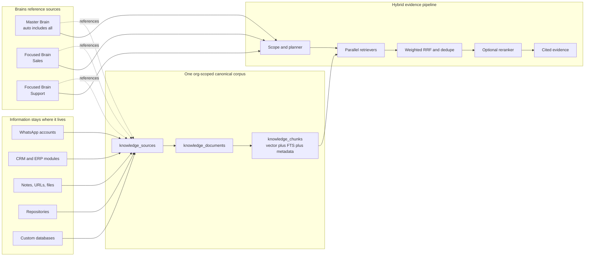

# Unified Brains Knowledge Architecture

**Date:** 2026-07-21  
**Status:** Accepted for implementation  
**Scope:** `minion_hub/` `/brains`, Hub Postgres/pgvector, Gateway brain tools  
**Primary reference:** Cerebras, “How We Built Our Knowledge Base” (2026-07-15)  
**Decision owner:** Nikolas Piñón

## 1. Decision

Minion will make `/brains` the single org-scoped knowledge plane for embedded and
searchable business data.

Every organization receives:

1. exactly one **Master Brain**, which automatically searches every knowledge source
   the organization is permitted to index; and
2. zero or more **Focused Brains**, which search named subsets of the same sources
   without copying their documents, chunks, or embeddings.

Data is ingested once into a normalized org corpus and composed into brains by
references. A source can belong to the Master Brain and many Focused Brains while its
embedding is stored once.

The first production connector is the existing message ledger, beginning with
WhatsApp 1:1 conversations. Instagram and Telegram use the same connector contract.
Notes, URLs, uploads, module snapshots, code, Slack, documents, and custom databases
follow the same source/document/chunk interface.



## 2. Why the current architecture must change

The existing Brains subsystem already provides valuable foundations:

- org-scoped RLS through `withOrgCore`;
- `brains`, `brain_documents`, `brain_chunks`, and `brain_access`;
- cosine search over 1,536-dimensional `text-embedding-3-small` vectors, with
  HNSW as an optional acceleration layer;
- durable `brain_ingest` background jobs;
- note, URL, upload, and three `module_ref` renderers;
- per-brain Hub and Gateway search APIs.

Its core ownership relationship is wrong for the desired product. `brain_documents`
and `brain_chunks` both carry a required `brain_id`. The same source placed in Master,
Sales, and Support brains therefore requires three physical copies and three embedding
charges. Search is vector-only, chunks are fixed character windows, source refresh is
mostly manual, and there is no first-class source registry or synchronization state.

The existing CRM conversation vectorizer solves a different slice in separate tables
(`crm_conversation_chunks`, `crm_conversation_index`). It has useful conversation
chunking and signature ideas, but it is not visible in `/brains`, is keyed without
`account_id`, mixes all channels in one candidate page, and currently suffers a
microsecond-to-millisecond watermark bug that starves later conversations.

## 3. Cerebras comparison and adaptation

| Concern | Cerebras | Current Minion | Target Minion |
|---|---|---|---|
| Corpus | One embeddings table for all sources | Separate brain, CRM, and agent-memory vector tables | One canonical brain corpus per org |
| Organization | Projects reference shared sources | Chunks belong directly to one brain | Master/Focused brains reference shared sources |
| Source contract | Connector emits common embedding rows | Bespoke loaders and tables | Registered connector emits normalized documents |
| Slack/chat unit | Whole thread, distilled summary, selected bursts | Raw role-tagged fixed-size conversation chunks | Conversation document + normalized summary + optional signal bursts |
| Freshness | Real-time Slack events; source-specific fetch cadence | Hourly CRM scan; manual brain reingest | Ingest marks source documents dirty; durable jobs drain; reconcile cron |
| Incrementality | Stable sync metadata; changed code chunks only | Conversation signature, but fixed-page/watermark defects | Content hashes + source revision + durable dirty queue/cursor |
| Retrieval | Vector + FTS + IDF + age decay | Vector cosine only | Vector + Postgres FTS + rarity + source-specific recency |
| Fusion | Weighted RRF, dedupe, diversity cap | None | Weighted RRF (k=60), source/document dedupe and caps |
| Reranking | Small model scores top 20, keeps top 10 | None | Optional bounded reranker after deterministic fusion |
| Context | Expand neighboring sections after ranking | Returns isolated chunk | Neighbor expansion after final ranking |
| Query orchestration | Planner → parallel executor → synthesizer | One direct brain search tool | Primitive tools plus Hub planner/executor/synthesis |
| Extensibility | Plugin connector scripts | Hard-coded module renderers | Connector registry with stable normalized output |
| Security | Authentication, authorization, audit | Org RLS + brain access | Preserve RLS/access; source grants intersect brain grants |

Minion should copy the architectural principles, not Cerebras-specific implementation
details. WhatsApp conversations are customer evidence, not engineering Slack threads;
recency weighting must be configurable by source, and raw content must remain available
for exact evidence and citations.

## 4. Product model

### 4.1 Brain kinds

- `master`: one per org, created automatically, `include_all_sources=true`; cannot be
  deleted. It is the default scope for the org assistant.
- `focused`: user-created named scope over selected sources and optional source filters.
- Existing brains migrate to `focused`.

Brains are query scopes, access policies, defaults, and agents. They do not own copies
of knowledge.

The Master Brain is the org fallback. A user or agent may select a Focused Brain as
its default scope; that preference changes query routing only and never duplicates
corpus rows. If a saved default becomes inaccessible, resolution fails back to the
Master Brain after re-checking its access policy.

### 4.2 Sources

A source is one logical upstream feed, for example:

- WhatsApp account `+51922286663`;
- Instagram account/page;
- CRM contacts;
- finance product catalog;
- a Slack channel;
- a Git repository;
- an uploaded document collection;
- a custom database connector.

Source identity is `(org_id, connector, external_key)`. Account identity belongs here;
it must never be omitted from conversation identity.

Sources carry `name`, `connector`, `external_key`, `config`, `status`, `sync_mode`,
`cadence`, `watermark`, `last_synced_at`, `last_error`, and timestamps. Secrets remain
outside row metadata and are resolved server-side.

### 4.2.1 Default organization sources

The Master Brain is useful only if it reflects the organization without requiring a
user to manually add every Hub module. Each org therefore discovers the following
first-class sources by default whenever the underlying module exists:

| Source | Canonical scope | Representative records |
|---|---|---|
| Stock | Inventory and movement state | items, warehouses, bins, entries, consumption, accruals, components |
| CRM | Customer relationship knowledge | contacts, identities, tags, activities, lifecycle and conversation analysis |
| Socials | Published and paid social performance | assets, posts, post/ad insights, campaign attribution |
| Finances | Commercial and accounting facts | clients, products, invoices, invoice lines, payments |
| Schedules | Availability and appointments | resources, schedules, event types, bookings, reminders |
| Org chart | People, roles, and reporting structure | org members, parties, agent parties, roles and assignments |
| Projects | Planned and active work | projects, tasks, templates, milestones/timesheets where present |
| Memberships | Subscription/customer membership state | plans, cycles, member subscriptions |
| Point of sale | Store transactions | shifts, tickets, ticket lines and payments |
| Sales | Orders outside the POS flow | sales orders and their current commercial state |
| Support | Customer support work | support issues and their status/history |
| Workflows | Organization-authored automation | workflow definitions and safe public configuration |
| Agents and memories | Organization agent knowledge | agent records and non-secret agent memories |

This list is a floor, not a closed enum. A new user-facing org module must register a
safe normalizer when it is introduced so it becomes discoverable by the Master Brain.
Focused brains remain opt-in references to any subset of these sources.

“All org data” does **not** mean indiscriminate database serialization. Connector
normalizers must exclude credentials, access/refresh tokens, encrypted secrets,
password or session material, provider configuration secrets, raw background-job
payloads, backup/repair tables, and high-volume audit/telemetry that has no durable
knowledge value. Personally identifying business data may be indexed inside its org,
but brain access and field-level policy still apply at query time.

Each business record has a stable document identity (`<domain>:<entity>:<id>`), a
deterministic text representation, safe structured metadata, and a source revision
derived from its latest upstream update. Refresh is content-hash driven: unchanged
documents and chunks keep their existing embeddings; changed records replace only
their changed chunks; deleted upstream records receive tombstones. A daily reconcile
repairs missed events, while module mutations may enqueue a bounded source refresh.

### 4.3 Normalized documents

A connector emits documents with a stable `external_id` and:

- `title`;
- `raw_text` for exact/lexical evidence;
- `normalized_text` optimized for semantic retrieval;
- `source_revision` and `content_hash`;
- `occurred_at`, `source_updated_at`, and `ingested_at`;
- structured `metadata` including citations, participants, channel/account/chat IDs,
  CRM contact/party IDs, and source-native URLs;
- optional parent/neighbor identifiers.

Document uniqueness is `(org_id, source_id, external_id)`. Upsert is idempotent.
Unchanged `content_hash` updates only freshness metadata and does not enqueue embedding.

### 4.4 Chunks

Chunks belong to documents, not brains. Chunk uniqueness is
`(org_id, document_id, chunk_key)`.

Each chunk carries:

- `kind`: `summary`, `section`, `burst`, `code_file`, `code_symbol`, or `raw`;
- `chunk_text` and optional `context_prefix`;
- embedding and embedding model/version;
- a Postgres `tsvector`/GIN lexical index;
- token/character count;
- sequence and neighbor keys;
- source timestamps and metadata;
- `content_hash`, enabling changed-chunk-only replacement.

For chat sources, the first implementation creates one normalized conversation document
per `(org_id, source/account_id, channel, chat_id)` and chunk keys deterministically.
The initial normalizer is deterministic and role-tagged. LLM distillation and burst
selection are additive pipeline stages, not blockers for the first migration.

### 4.5 Brain membership

`brain_sources` links focused brains to sources. A source row is referenced, never
copied. Master Brain membership is implicit through `include_all_sources`, subject to
source access and enabled status.

Optional membership config contains source weight, recency half-life, metadata filters,
and enabled chunk kinds. A shared source may be referenced by many brains.

## 5. Physical schema

The implementation introduces:

### `knowledge_sources`

`id uuid pk, org_id text, connector text, external_key text, name text,
config jsonb, status text, sync_mode text, cadence text, watermark jsonb,
last_synced_at timestamptz, last_error text, created_at, updated_at`

Unique: `(org_id, connector, external_key)`.

### `knowledge_documents`

`id uuid pk, org_id text, source_id uuid fk, external_id text, title text,
raw_text text, normalized_text text, content_hash text, source_revision text,
occurred_at timestamptz, source_updated_at timestamptz, ingested_at timestamptz,
status text, metadata jsonb, created_at, updated_at`

Unique: `(org_id, source_id, external_id)`.

### `knowledge_chunks`

`id uuid pk, org_id text, source_id uuid fk, document_id uuid fk, chunk_key text,
kind text, seq int, chunk_text text, context_prefix text, content_hash text,
embedding vector(1536), embedding_model text, search_vector tsvector,
occurred_at timestamptz, metadata jsonb, created_at, updated_at`

Indexes: GIN `search_vector`, `(org_id, source_id, document_id)`, and source
recency. HNSW cosine is an optional accelerator; exact cosine scans remain the
correct fallback when storage policy disables ANN.

### `brain_sources`

`brain_id uuid, org_id text, source_id uuid, weight real, config jsonb, created_at`.
Primary key `(brain_id, source_id)`.

### Changes to `brains`

Add `kind text not null default 'focused'`, `include_all_sources boolean not null
default false`, and unique partial index enforcing one master per org.

All new tables use forced RLS with `app_ledger` and `app.current_org_id`, matching the
existing brains policies.

The legacy `brain_documents` and `brain_chunks` remain readable during transition.
New writes use the canonical corpus. A later migration removes them after all callers
and data have migrated.

## 6. Connector and ingestion contract

Connectors implement:

```ts
interface KnowledgeConnector {
  id: string;
  discover(ctx): Promise<DiscoveredSource[]>;
  scan(ctx, source, cursor, limit): Promise<ScanPage>;
  normalize(ctx, source, item): Promise<NormalizedDocument>;
  chunk(ctx, source, document): Promise<NormalizedChunk[]>;
}
```

`scan` returns a durable next cursor and deletion tombstones. Work is advanced through
`bg_jobs`; one `advance()` handles a bounded page. Network/model calls occur outside
database transactions.

### WhatsApp connector

1. Discover one source per distinct, currently configured WhatsApp `account_id`.
2. Dirty identity is `(org_id, account_id, channel, chat_id)`.
3. Message ingest upserts a dirty marker after the ledger transaction commits.
4. Worker loads the complete eligible 1:1 conversation for that account/chat.
5. It deduplicates relinked history using stable channel `message_id` where present.
6. It writes raw role-tagged transcript and deterministic normalized text.
7. It chunks by turns/paragraphs near the target token size, preserving complete
   messages where possible.
8. Only chunks whose `content_hash` changed are embedded; stale trailing chunks are
   deleted.
9. Deletions and missed hooks are repaired by a cursor-driven full reconciliation.

The existing CRM vectorizer remains temporarily as a compatibility consumer, then its
search endpoint delegates to the Master/CRM brain before the old tables are retired.

### 6.1 Source-specific document units

A connector must choose the smallest stable unit that preserves meaning without
turning append-only activity into unbounded rewrites. There is no universal
record-to-document mapping.

| Source shape | Document identity and contents | Why |
|---|---|---|
| WhatsApp/chat | `(account, chat, calendar-month)` transcript segment | Bounds re-hash/re-embed work and keeps history inserts from renumbering the lifetime conversation |
| CRM contact | One contact with identities, safe attributes, tags, lifecycle and recent aggregate signals | An entity is the retrieval unit; derived per-message caches are not copied |
| Invoice | Invoice header plus its line items and payments | Users ask about the commercial document, not detached rows |
| POS ticket | Ticket header plus lines and tenders | Preserves the transaction as one cited fact |
| Stock entry | Entry header plus movement lines | Preserves a coherent inventory event |
| Social post | Post plus all current metrics and attribution | Avoids one document per metric |
| Paid ad telemetry | One ad per bounded reporting window with a compact series/aggregate | Avoids one document per ad-day while retaining trend evidence |
| Project | Project summary; tasks/timesheets may be child sections when independently useful | Preserves project context and supports task-specific search |
| Schedules | Resource/event-type entities and one booking per appointment | Bookings are independently actionable facts |
| Roles/org chart | One department/role/member/agent relationship entity | Preserves attribution and reporting context |

Parent documents use stable child ordering and child-native IDs in chunk keys. A new
line or metric must not renumber unrelated chunks. High-volume telemetry is summarized
before embedding; exact raw facts remain queryable through lexical/native retrieval.

Business scanning uses an index-served cursor per table:
`{domain, tableIndex, lastPrimaryKey}`. It never re-sorts a full `UNION ALL` for every
page. Deletion reconciliation compares one materialized upstream-ID pass against the
source documents and tombstones missing IDs once per completed domain scan.

### 6.2 Conversation representations

The initial role-tagged monthly transcript is the exact evidence layer. The target
conversation representation adds, without deleting raw evidence:

1. a deterministic monthly transcript chunk set;
2. an LLM-distilled conversation/month summary embedded as `kind=summary`;
3. selected signal bursts embedded as `kind=burst`; and
4. citations back to the source message IDs and time span.

Burst extraction follows the Cerebras principle: group consecutive same-author turns,
prepend the conversation topic, and keep sufficiently substantial/high-information
runs. Rarity, reactions, and source-native engagement may select bursts, but no single
threshold is copied blindly across WhatsApp and Slack. The exact thresholds are tuned
on Minion's labeled retrieval set.

Summary generation is versioned (`normalizer_version`, prompt/model version) and
idempotent. A summary failure leaves raw chunks searchable. Changed raw segments
invalidate only their own summary/bursts.

### 6.3 Small-model enrichment and execution settings

Raw normalization, lexical indexing, embeddings, and retrieval do not require an LLM.
When a connector adds per-segment question/summary/resolution extraction or a bounded
reranker, that high-volume enrichment must use an explicitly configured **small,
fast model**. Frontier models used for architecture review are never the default for
per-chunk work.

Enrichment configuration is organization-scoped and separates two independent
choices:

1. `harness`: the server-registered execution adapter (`claude-code`, `codex`,
   `drone`, `pi`, or a validated custom adapter ID); and
2. `model`: a provider/model identifier supported by that harness.

Examples include a small Codex-compatible profile, Claude with a Haiku-class model,
or Drone/Pi using an allowlisted OpenRouter small-model identifier. These are
capability examples, not permanent hard-coded model names: the Hub validates the
selected harness/model pair against the installed runtime and model catalog. A custom
OpenRouter identifier is accepted only by adapters that declare OpenRouter support.
Provider credentials remain server-side and are never stored in the public settings
payload. An organization may never provide an executable path, shell command, or
arbitrary adapter implementation. Adapter binaries and custom adapter IDs are
registered by platform operators in deploy-time server configuration.

Enrichment executes on the organization's linked Gateway worker, not in the Hub's
Vercel runtime. The Hub asks the active build-channel Gateway for its registered
harness/model capabilities, caches the health response briefly, and rejects or marks
unsupported selections degraded. A stale capability cache never authorizes a new
adapter. The worker invokes the selected adapter in single-shot structured-completion
mode with no tools, filesystem, subprocess, or source-controlled network access; its
only permitted egress is the configured model provider. Model output must validate
against the connector's versioned JSON schema before it can enter the corpus.

The Hub exposes this configuration as a Brains subpage under `/brains/settings`.
The global Settings navigation owns the gear icon; the existing
Template navigation uses a template-specific icon. Only organization owners/admins
may mutate enrichment settings. Read access may expose the effective non-secret
configuration and health to authorized operators.

The enrichment job is separate from raw ingest and embedding jobs. It is:

- content-addressed and cached by source content hash plus prompt/model version;
- batched and concurrency/rate limited per organization;
- idempotent, retryable, and poison-item isolated;
- cost- and token-budget bounded;
- optional, so failure never removes raw FTS/vector evidence; and
- observable by harness, model, prompt version, latency, token use, failures, and
  fallback state.

Server-side model catalogs—not a free-form client field—enforce compatible adapters,
an allowlist, and a maximum input/output price per million tokens. The organization
may select only catalog entries within the platform's small-model ceiling. Each org
has an enforced daily token budget; exhaustion pauses enrichment, marks the affected
source degraded with an actionable reason, and never drops raw work. A platform kill
switch can disable all LLM enrichment independently of raw ingest/search. Provider
catalog entries declare whether organization or platform credentials pay for usage;
credential material is resolved only inside the Gateway worker.

Distillation and query-time reranking have different latency profiles. Settings may
inherit one default small model while permitting separately validated role overrides
for `distillation` and `reranking`. Queue draining is round-robin across organizations
with per-org concurrency so a large backfill cannot starve smaller tenants.

Conversation enrichment runs once per meaningful monthly segment, not once per raw
chunk. The connector's versioned schema extracts source-appropriate topics, requests,
complaints, commitments, outcomes, and named entities; it does not force engineering
thread question/resolution semantics onto customer chat. Segments below a configurable
minimum-information/token threshold skip LLM distillation and retain raw evidence.
Derived summaries and bursts are tagged as untrusted-source derivatives so downstream
synthesis fences them from instructions. Prompt injection or schema failure poison-
isolates only that enrichment item.

The default configuration selects a small-model profile. Changing harness or model
creates a new enrichment version and queues only affected summaries/bursts; it does
not rewrite raw documents or mix incompatible embedding vector dimensions. New
summary/burst chunks carry the enrichment version in their stable key; activating the
new version and superseding prior derived chunks occurs atomically so two versions of
the same derived fact are never co-retrievable.

During the Phase B compatibility backfill, raw monthly chat chunks may retain vectors
so semantic search remains available before distillation exists. Once the derived
summary/burst pipeline reaches measured recall parity, raw chat transcripts remain in
FTS and as citation evidence but leave the primary vector candidate set, matching the
Cerebras pattern of embedding distilled representations rather than entire raw
transcripts. This transition is versioned and evaluation-gated, not a blind destructive
migration.

## 7. Retrieval pipeline

### 7.1 Scope resolution

Resolve the requested brain and intersect:

- org RLS;
- brain visibility and `brain_access`;
- source access;
- Master all-sources or Focused `brain_sources` membership;
- optional source/metadata filters.

### 7.2 Primitive retrieval

Run in parallel:

1. vector cosine search over normalized chunks;
2. Postgres full-text search over raw/normalized chunk text;
3. optional source-native exact retrieval where useful;
4. deterministic rarity and source-specific age scores.

Every retriever returns a shared evidence row with source, document, chunk, score,
timestamp, metadata, and citation fields.

### 7.3 Fusion and ranking

- Fuse rank lists with weighted RRF: `sum(weight / (60 + rank))`.
- Collapse duplicate chunks and repeated relinked message history.
- Cap contributions per document/source to preserve diversity.
- Keep the best 20 deterministic candidates.
- Optionally ask a small reranker for a 0–10 relevance score and retain 10.
- Expand neighbors only after ranking.

The API returns both the final score and component scores for observability.
If reranking is unavailable, deterministic fused ranking remains functional.

### 7.4 Tools and UI

Gateway/MCP primitives remain narrow and stable:

- `brains_list`
- `brain_search`
- later: `brain_search_lexical`, `brain_sources`, `brain_get_evidence`

The `/brains` web experience may run planner → parallel executor → synthesizer, but
retrieval itself is LLM-independent and returns evidence with citations.

### 7.5 Search-query semantics and result presentation

The Hub search box submits the user's natural-language query unchanged, plus optional
source/kind/metadata filters. Retrieval then:

1. embeds the query for semantic vector candidates;
2. parses it with Postgres `websearch_to_tsquery('simple', query)` for lexical
   candidates;
3. for short entity-like terms, retrieves a bounded indexed `pg_trgm` candidate set so
   one-edit spellings such as `krispy` can reach corpus `KRISPI` without depending on
   vector top-k recall;
4. identifies exact normalized token/phrase overlap so a literal entity lookup cannot
   be outranked by semantically loose vector-only evidence;
5. fuses the independent candidate ranks, applies source weight and bounded recency,
   deduplicates, and enforces source/document diversity;
6. expands neighboring chunks only after ranking for downstream agent context; and
7. returns a query-centered excerpt for the human Search tab.

Reciprocal-rank fusion is an ordering signal, not a calibrated probability. The UI
must label it as relevance/rank and must not turn it into a “match percentage.” A
result card shows the source, document, match basis, date, and concise excerpt around
the lexical match when present. Full neighboring evidence remains available to agents
and an explicit detail disclosure, not as the default card body.

### 7.6 Recall, reranking, and synthesis

Filtered vector search must not starve small Focused Brains. When HNSW is installed,
vector transactions set a bounded ANN candidate breadth (`hnsw.ef_search=200`, tuned
from evaluation) before applying org/brain/source filters. Without HNSW, the same
distance and policy filters run as an exact scan. The service records vector, lexical,
and post-policy candidate counts; “candidates existed but all were rejected” is a
distinct empty result with a diagnostic, never an invitation to reintroduce noisy
legacy hits.

Deterministic fusion is always available. The optional second stage sends at most the
best 20 fused candidates to a small reranker, scores relevance on a 0–10 rubric, and
keeps at most 10. Reranker failure returns the deterministic order. A synthesizer may
answer over the retained evidence, but it must cite source/document/chunk identities
and may not claim facts absent from evidence.

Short entity-like queries use anchored lexical/fuzzy evidence. Multi-token questions
may be semantic. Recency is capped as a boost to already-relevant evidence; it cannot
make an irrelevant chunk eligible. Postgres uses the `simple` text-search dictionary
intentionally so Spanish function words such as `como` remain indexable.

Single-token trigram retrieval uses the reviewed `pg_trgm` migration and a GIN
`gin_trgm_ops` index whose expression exactly matches
`lower(knowledge_chunks.chunk_text)`. The query uses the indexed `%>` word-similarity
operator, applies the same org/brain/source membership, module, field-level, kind, and
metadata filters as the vector and FTS lanes, and caps candidates before fusion.
Trigram similarity only supplies candidates: the deterministic exact/edit-distance
policy remains the eligibility authority, so a loose trigram neighbor cannot become
evidence by score alone.

### 7.7 Authorization at retrieval time

RLS and brain visibility are necessary but insufficient for an all-source Master
Brain. Every source declares `requiredModule`; WhatsApp/customer conversations require
CRM access. Browser and Gateway principals carry their effective visible modules.
Retrieval fails closed for classified sources absent from that set.

Source and chunk metadata also carry sensitivity/ownership tiers. Until per-chunk
field-level and owner predicates are implemented, a principal with masked or
owner-scoped access must not receive an unrestricted source through Brain search; the
safe interim is to omit that source. The principal's searchable-module set therefore
excludes every module whose capability is owner-scoped, and source
`requiredFieldLevel` must not exceed the principal's effective level for its
`requiredModule`. CRM, finance, schedules, and WhatsApp sources require field level 1.
Unclassified legacy chunks are not a fallback for scoped non-owner/admin principals.
Focused Brain membership never broadens access.

## 8. `/brains` UX

The collection page shows real corpus state, not empty decorative cards:

- Master Brain first, visually identified as the org-wide default;
- Focused Brains below;
- source count, document count, embedded chunk count, dirty/pending count;
- source composition and connector health;
- last successful synchronization and errors;
- create Focused Brain action.

The detail page tabs become:

1. **Overview** — corpus health, coverage, freshness, and connector breakdown;
2. **Sources** — shared source membership and source-specific sync controls;
3. **Search** — hybrid evidence results with source, score components, timestamp, and
   citation context;
4. **Access**;
5. **Agent**;
6. **Activity**.

The Master Brain cannot remove sources directly; disabling a source is an org-level
source action. Focused Brains add/remove source references without re-ingestion.

All UI uses shared Hub primitives, Paraglide strings, semantic tokens, and passes
`lint:design` plus `lint:tokens`.

## 9. Migration and rollout

### Phase A — schema and compatibility

1. Apply new tables/columns/RLS/indexes.
2. Add repository/service types and dual-read support.
3. Ensure one Master Brain per existing org.
4. Preserve legacy brain document search.

### Phase B — real message corpus

1. Discover sources from real message ledger account IDs.
2. Create shared WhatsApp sources.
3. Backfill conversations in durable pages.
4. Populate Master Brain implicitly.
5. Create an initial focused “WhatsApp Conversations” brain per org referencing those
   sources, where data exists.
6. Display live counts and job status in `/brains`.

### Phase C — hybrid retrieval

1. Add FTS/GIN and vector retrievers.
2. Add rarity/recency scoring, RRF, dedupe, diversity caps, neighbor expansion.
3. Route `brain_search` and CRM conversation search through the unified service.

### Phase D — all Hub business sources

1. Discover the default Stock, CRM, Socials, Finances, Schedules, Org chart, Projects,
   Sales, POS, Memberships, Support, Operations, Email, and Pulse sources.
2. Backfill parent-aggregated, deterministic business documents with per-table cursors.
3. Apply source-module authorization and safe reviewed field projections.
4. Show every discovered/indexed source and its real health/counts in Master Brain.

Rollout order is mandatory: deploy the new monthly/parent-aware worker code first;
apply source/RLS/settings migrations; apply legacy-document tombstones only when an
immediate explicit reconcile/backfill drain is ready; then verify source timestamps,
document/chunk counts, missing embeddings, and representative searches. The daily cron
is repair coverage, not the migration trigger.

### Phase E — richer normalization and external connectors

1. Add organization-scoped Brains enrichment settings with independently selectable
   harness and compatible small model.
2. Add LLM conversation distillation and signal-burst chunks through the versioned,
   cached enrichment queue.
3. Migrate module refs, notes, URLs, uploads, and agent memories.
4. Add Slack/code/document/custom connector packages.
5. Retire duplicate vector tables after parity and data verification.

## 10. Operational requirements

- Every source exposes discovered, queued, processing, ready, degraded, or failed.
- Every job records scanned, changed, embedded, deleted, remaining, and cost estimates.
- Ingestion latency and backlog are observable per org/source.
- Cron output cannot be discarded without durable job/error state.
- Source scans use durable cursors, not repeated fixed first pages.
- A failing source cannot block later orgs or sources.
- Embedding provider/model version is stored with each chunk; model migration uses a
  new embedding column or explicit versioned rebuild, never mixed vectors.
- Query logs record brain, source filters, retrievers, timings, chosen evidence IDs,
  and citations without logging secrets.

### 10.1 Deferred persisted query log

Persisted retrieval telemetry is intentionally deferred from the first implementation
slice pending a schema, privacy, and retention review. A future org-scoped
`brain_query_logs` table should record:

- `org_id`, `brain_id`, request class, and a non-reversible requester identifier hash;
- query hash and policy version, with raw or redacted query text only by explicit
  opt-in;
- source/kind/metadata filters, retriever timings and candidate counts;
- deterministic empty reason and warnings, selected evidence IDs, and citation IDs;
- creation and expiry timestamps for enforced retention.

The table must use forced org RLS and must not contain chunk bodies, expanded evidence,
credentials, or other secrets. Writes should be asynchronous and best-effort outside
the retrieval transaction; telemetry failure must never delay or fail search. No
telemetry table is added until the separate review fixes retention, access, and
redaction policy.

### 10.2 ANN indexes under constrained storage

Embeddings are canonical data; HNSW and IVFFlat indexes are optional acceleration
structures. The current production storage ceiling requires exact cosine scans for
the unified knowledge corpus and the legacy CRM conversation corpus until capacity is
raised or a smaller measured representation is migrated safely. Lexical FTS and
trigram indexes remain enabled.

The forward storage-guard migration runs after both ANN creator migrations and drops
only `knowledge_chunks_embedding_hnsw` and
`crm_conversation_chunks_embedding_ivfflat`. The same capacity repair removes the
unused global `messages_message_id_idx`; org-scoped client and provider idempotency
indexes remain mandatory. It also removes `agent_memories_embedding_hnsw`, which the
current composite relevance, recency, and importance ranking cannot use. Ordinary
ledger-backed production and fresh empty replays are safe. A populated restore with a missing or rewound
`hub_migrations` ledger is exceptional: reconcile or restore that ledger (or omit the
two ANN creator statements) before replay, because the expensive historical index
builds could exhaust storage before the guard migration is reached.

Reintroducing ANN requires a measured capacity plan, index build headroom, retrieval
latency baselines, and post-build validity checks. It must not delete or rewrite
canonical embeddings merely to satisfy a provider storage limit.

## 11. Acceptance criteria for the first implementation slice

1. Production schema contains canonical source/document/chunk/membership tables with
   forced org RLS.
2. Every org has one Master Brain.
3. Orgs with WhatsApp ledger data have discovered WhatsApp sources and at least one
   populated canonical conversation document/chunk.
4. `/brains` shows Master and Focused brains with real source/document/chunk counts and
   freshness status.
5. Focused brains reference sources without duplicate embeddings.
6. `brain_search` can retrieve real WhatsApp evidence through the Master Brain.
7. New message changes can be queued without full-corpus rescans; retries are
   idempotent.
8. Legacy brain search continues to work during migration.
9. Focused tests, `bun run check`, `bun run lint:design`, and `bun run lint:tokens` pass.
10. The deployed `/brains` UI is visually verified with authenticated real data.
11. Every default Hub business source appears in each Master Brain; populated sources
    have indexed documents and zero unexplained pending embeddings after the drain.
12. Literal/fuzzy query fixtures (`krispy` → corpus `KRISPI`) retain only anchored
    evidence, while `como` produces a query-centered excerpt rather than a lifetime
    transcript dump.
13. Monthly conversation segmentation, parent-child business aggregation, per-table
    cursor progression, and source-module denial all have regression tests.
14. `/brains/settings` persists an org-scoped harness and compatible small-model
    selection, rejects invalid pairs, exposes no credentials, and limits mutation to
    owners/admins.
15. Any per-segment LLM enrichment is content-hash cached, versioned, independently
    retryable, and cannot make raw search unavailable when the configured harness or
    model fails.

## 12. Explicit non-goals for the first slice

- Reproducing Cerebras’ entire Slack distillation pipeline immediately.
- Migrating every existing vector table in one deployment.
- Making Cerebras inference hardware a dependency.
- Embedding email bodies, which the current ledger does not retain.
- Granting a Focused Brain access beyond the intersection of its brain and source
  policies.

## 13. Key architectural rule

**Ingest once. Embed changed chunks once. Reference sources from many brains. Search
through an explicit brain scope.**
