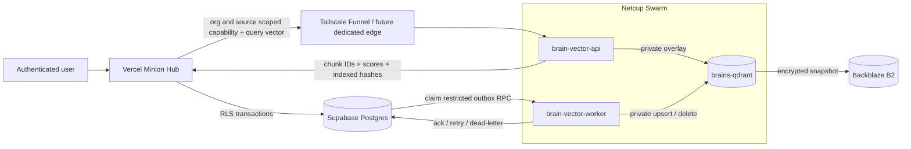
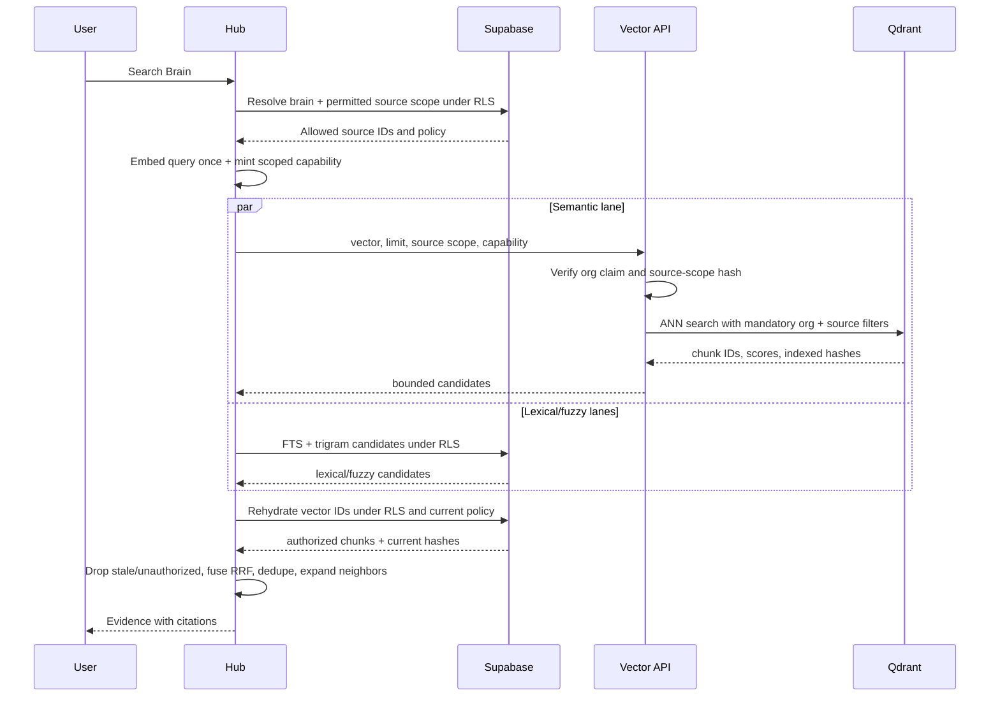

# Self-hosted Qdrant for Unified Brains

**Date:** 2026-07-22  
**Status:** Proposed architecture; implementation not started  
**Decision owner:** MINION  
**Affected systems:** `minion_hub`, `minion`, `@minion-stack/shared`, Netcup Swarm, Supabase, Backblaze B2  
**Related:** [Unified Brains Knowledge Architecture](./2026-07-21-unified-brains-knowledge-architecture.md), [Gateway Swarm Cutover](./2026-07-13-minion-gateway-swarm-cutover.md)

## 1. Decision

MINION will add a dedicated, self-hosted Qdrant deployment to the Netcup Docker
Swarm and use it as the **semantic serving index** for Unified Brains.

Supabase remains the system of record for:

- organizations, users, roles, and authorization;
- knowledge sources, documents, canonical chunk text, and metadata;
- brain-to-source composition;
- lexical and fuzzy indexes;
- the durable vector-index outbox; and
- during the first production generations, the canonical embedding vector used for
  exact-search rollback and deterministic Qdrant repair.

Qdrant stores a rebuildable serving copy of embeddings plus the minimum payload
required to filter semantic candidates. It does not store chunk text, arbitrary
source metadata, credentials, brain membership, or authorization policy. It never
decides what a user is allowed to read.

The production deployment is three isolated runtime roles, built from two images:

1. **`brains-qdrant`** — a private Qdrant container with a persistent local volume;
2. **`brain-vector-api`** — a narrow, authenticated HTTPS search service; and
3. **`brain-vector-worker`** — a private outbox consumer and reconciler using the same
   application image as the API but a different command and secret set.

The existing optional `openmemory-qdrant` Compose service is prior art only. Brains
does not share its container, volume, upgrade lifecycle, or collection namespace.

## 2. Why this boundary

The current corpus has 61,737 embedded chunks. At 1,536 float32 dimensions, raw
vectors account for 379,312,128 bytes, approximately 361.7 MiB before PostgreSQL row
and index overhead. Supabase can retain that canonical copy, but the attempted HNSW
accelerator exhausted provider disk during its build. The failed accelerator was
removed without losing canonical chunks or embeddings.

The Netcup host is already the stateful production compute plane: one 8-vCPU,
15-GiB-RAM, 512-GB ext4 host running the Minion Swarm behind Caddy, Cloudflare, and
Tailscale. Qdrant moves the ANN build and serving footprint to that controlled
storage plane without moving business authority or raw evidence out of Supabase.

This is intentionally not a general “move the database on-premise” decision. It is a
bounded secondary-index decision.

## 3. Governing invariants

1. **Supabase is authoritative.** Deleting Qdrant must be recoverable by replaying
   active Supabase chunks.
2. **Qdrant is candidate generation, not authorization.** Every returned point is
   rehydrated and reauthorized through the Supabase RLS path before its text or
   citation is returned.
3. **No raw text in Qdrant.** A Qdrant snapshot or point payload must not reveal a
   message, customer note, financial record, or other evidence body.
4. **The organization filter is service-derived.** The public API never trusts an
   `org_id` supplied in a request body.
5. **One chunk and generation, one deterministic point.** The Qdrant point ID is a
   UUIDv8 derived from canonical JSON containing `org_id`, `knowledge_chunks.id`,
   and the embedding generation. The canonical chunk UUID remains in the payload
   for RLS rehydration. Duplicate delivery is therefore an idempotent upsert while
   organization moves cannot overwrite another tenant's point.
6. **One corpus, many brains.** Qdrant does not duplicate a point for Master and
   Focused Brains. Brain scope is translated to allowed source filters at query time.
7. **One collection generation, one vector contract.** Model, dimensions, distance
   metric, and payload schema never change in place.
8. **Hybrid retrieval survives vector failure.** Lexical and fuzzy lanes remain
   independent. During the initial generations, exact Supabase vector search remains
   the kill-switch fallback.
9. **Enrichment is separate.** The configurable small-LLM enrichment harness may
   create or revise normalized chunks, but it is not part of Qdrant authorization or
   query-time retrieval.

## 4. Target topology



### 4.1 `brains-qdrant`

- Runs as a dedicated Swarm service constrained to
  `node.labels.minion.storage == netcup-local`.
- Uses a dedicated external volume, proposed name
  `minion_brains_qdrant_data`, mounted at `/qdrant/storage`.
- Joins a dedicated encrypted overlay, proposed name `minion_brains_vector_net`.
- Does not publish ports 6333 or 6334 to the host.
- Requires internal API keys even on the overlay. The pinned image review must prove
  that the selected Qdrant release supports a distinct read-only API key for the API
  service; otherwise the API/worker credential split is not considered implemented.
- Pins a reviewed Qdrant image by immutable digest. The current optional
  OpenMemory pin must not be copied without a fresh compatibility/security review.
- Starts with one replica. This is not HA; the supported failure mode is temporary
  vector degradation followed by volume recovery or rebuild.

### 4.2 `brain-vector-api`

- A small Node/TypeScript service under proposed path
  `minion/services/brain-vector/`.
- Exposes only search and health/status contracts; it is not a generic Qdrant proxy.
- Receives query vectors, never query text.
- Has Qdrant network access and the Qdrant read credential, but no Supabase worker
  credential and no embedding-provider credential.
- The first deployment is reached through a dedicated `/vectors` Tailscale Funnel
  path targeting a host-mode published API port. A future branded deployment may
  replace this with a dedicated Cloudflare Tunnel or independent edge; it must not
  restart or share the gateway Caddy lifecycle.
- The raw service port remains blocked on the public interface in both `INPUT` and
  Docker's forwarding path. Qdrant ports are never published.
- Enforces request-size, concurrency, dimension, collection-generation, and hard
  timeout limits. A dedicated rate limiter is required before organization-wide
  Phase 4 serving; Funnel controls are defense in depth, not the only limit.

### 4.3 `brain-vector-worker`

- Uses the same application image as the API but runs `worker` mode.
- Has no public port.
- Holds only a restricted Supabase worker credential and the internal Qdrant write
  credential. It does not receive Hub user sessions.
- Claims durable outbox work, copies canonical Supabase vectors into Qdrant, handles
  deletes, and runs bounded reconciliation.
- It does **not** call the small enrichment LLM. In the first architecture generation
  it also does not call the embedding provider; it copies the vector already produced
  by the canonical Hub ingestion path.

Splitting API and worker modes prevents a public query handler from also carrying the
database write authority required by indexing. They may share code and release
artifacts, but not runtime credentials.

## 5. Qdrant collection contract

### 5.1 Collection layout

Use one physical collection per embedding generation, shared across organizations.
Do not create a collection per organization or per brain.

Frozen v1 names:

```text
physical: minion_brains_v1__openai_te3s_1536_g1
alias:    minion_brains_active
shadow:   minion_brains_shadow
```

The physical generation fixes:

- embedding provider and model identity;
- 1,536 dimensions;
- cosine distance;
- point payload schema version; and
- quantization/on-disk-vector choices, if later enabled after measurement.

A model or dimensionality change creates a new physical collection. It is backfilled,
shadow-queried, and promoted through an alias flip. The old generation remains
available until rollback and restore gates pass.

The first implementation supports exactly one canonical embedding generation. Its
trigger enqueues only the configured active generation, and the worker copies the
single `knowledge_chunks.embedding` value. A second generation requires a separate
ADR covering canonical per-generation vector storage, re-embedding ownership, and
trigger targeting before the parallel-collection procedure above is activated.

### 5.2 Point identity and payload

The point ID is a deterministic UUIDv8 built from the first 16 bytes of SHA-256 over
canonical JSON `['minion-point-id-v1', org_id, chunk_id, generation]`, with the UUID
version/variant bits set. The vector is the canonical `knowledge_chunks.embedding`
for the active embedding generation. `chunk_id` stays in the payload because the
opaque point ID is intentionally not reversible.

Allowed payload:

```ts
interface KnowledgePointPayloadV1 {
  chunk_id: string;
  org_id: string;
  source_id: string;
  document_id: string;
  kind: string;
  occurred_at: string | null;
  content_fingerprint: string;
  embedding_model: string;
  embedding_generation: string;
  payload_schema: 1;
}
```

Explicitly forbidden payload:

- `chunk_text`, `raw_text`, `normalized_text`, or context windows;
- arbitrary document/source metadata;
- names, phone numbers, email addresses, financial values, or CRM notes;
- brain IDs or copied brain membership;
- access roles, user IDs, credentials, or policy expressions.

Create payload indexes for `org_id`, `source_id`, `kind`, and
`embedding_generation`. Add other payload indexes only after a measured query need.

`content_fingerprint` is
`HMAC-SHA-256(index-fingerprint-key, chunk_id || content_hash || generation)`, not the
raw content hash. The Hub and worker receive the versioned fingerprint key through the
existing secrets plane; the vector API does not need it. This preserves stale-point
validation without turning a stolen payload or snapshot into an exact-text
confirmation oracle.

### 5.3 Shared-collection tenant safety

A shared collection is operationally smaller and matches the canonical one-copy
corpus, but it concentrates tenant filtering into one mandatory boundary. Therefore:

- every search filter starts with an exact `org_id` condition derived from a signed
  claim, never the body;
- the API rejects tokens without exactly one organization claim;
- source filters are hashed into the signed capability and verified against the body;
- a missing or empty resolved source scope returns no candidates rather than widening
  to all sources;
- deployment tests create two organizations with deliberately similar text and prove
  that neither can obtain the other's point IDs;
- recall is measured for a synthetic small organization as well as the largest one,
  because filtered graph search can behave differently when a tenant owns a small
  fraction of the collection.

## 6. Authorization and service authentication

### 6.1 Search capability

After the Hub authenticates the user, resolves the Brain, intersects Brain membership
with source/module/record/field policy, and obtains a final source list, it mints a
short-lived search capability:

```json
{
  "iss": "minion-hub",
  "aud": "minion-brain-vector",
  "sub": "profile-or-agent-id",
  "org_id": "canonical-org-id",
  "brain_id": "brain-uuid",
  "generation": "openai_te3s_1536_g1",
  "source_scope_hash": "sha256(canonical-sorted-source-ids)",
  "op": "search",
  "jti": "unique-id",
  "iat": 0,
  "exp": 0
}
```

Initial maximum TTL: five minutes. Normal search calls should mint a much shorter
token when practical. Capabilities use asymmetric Ed25519/EdDSA signatures. The Hub
alone holds the private signing key; the vector API holds a versioned public-key set
and selects a key through JWT `kid`. Rotation publishes the new public key before the
Hub begins signing with it and retains the previous public key until all old tokens
have expired. The API:

1. verifies signature, issuer, audience, expiry, and operation;
2. derives `org_id` only from the token;
3. canonicalizes the body source IDs and checks their hash against the token;
4. requires the request generation to match both the token and the collection bound to
   `minion_brains_active`;
5. rejects a missing, malformed, or widened scope;
6. builds the Qdrant filter itself; and
7. logs only the capability identifiers and aggregate timings, not vectors or scores
   for discarded candidates.

This bounds the usefulness of a stolen capability and protects against request-body
tampering and accidental filter omission. TTL does not prevent replay within the
validity window; `jti` supports audit correlation rather than a distributed replay
cache. The design does not claim to contain a full remote-code-execution
compromise of the Hub backend: that runtime already holds Supabase server authority.
The architecture must not describe the vector service as a stronger tenant boundary
than the canonical Hub/Supabase trust boundary.

### 6.2 Indexer database authority

Do not place the Supabase `postgres` password or a broad service role in the worker.
Create a dedicated `brain_vector_worker` login/role with only `EXECUTE` on narrowly
scoped `SECURITY DEFINER` functions:

- `claim_brain_vector_jobs(worker_id, limit, lease_seconds)`;
- `ack_brain_vector_job(chunk_id, generation, revision)`;
- `retry_brain_vector_job(...)`;
- `dead_letter_brain_vector_job(...)`; and
- bounded reconciliation readers.

The functions set safe timeouts, use fixed `search_path`, validate limits, and return
only the vector and payload fields required for indexing. Direct table access is
revoked. Implementation must prove that the selected Supabase connection path can
authenticate this custom role before the worker is built around it.

### 6.3 Separate write authority

Interactive search tokens can never call indexing or reconciliation operations. The
worker does not expose those operations through the public API. Operational reconcile
and alias promotion require a distinct administrator capability and an auditable
operator command.

## 7. Durable indexing path

### 7.1 Outbox schema

Proposed Supabase table:

```sql
brain_vector_outbox (
  chunk_id uuid not null,
  org_id text not null,
  collection_generation text not null,
  desired_operation text not null, -- upsert | delete
  desired_content_hash text,
  revision bigint not null,
  status text not null,            -- queued | running | dead
  attempts integer not null,
  available_at timestamptz not null,
  lease_owner text,
  lease_until timestamptz,
  last_error text,
  created_at timestamptz not null,
  updated_at timestamptz not null,
  primary key (chunk_id, collection_generation)
)
```

The row represents the **latest desired state**, not an append-only delivery log.
Every mutation increments `revision`. An ACK succeeds only when the persisted revision
still equals the worker's claimed revision. A revision-matched successful ACK deletes
the outbox row; if the revision changed, the newer desired state remains queued.
`dead` rows remain until operator repair or explicit discard. Canonical/index parity is
therefore computed by the reconciler from Supabase chunks versus Qdrant points, never
by treating an empty outbox as proof of parity.

The migration also creates a singleton/generation control row with
`enqueue_enabled=false` by default. The trigger enqueues only while that flag is true.
This makes the migration forward-safe before dark infrastructure is ready and lets an
abandoned rollout disable enqueueing without dropping canonical tables or functions.

### 7.2 Enqueue mechanism

A database trigger on `knowledge_chunks` is the safety net:

- insert with a valid embedding → enqueue/upsert `desired_operation='upsert'`;
- change to content hash, embedding model, generation, or vector → increment revision
  and enqueue `upsert`;
- delete → enqueue `delete` using the old chunk ID and organization;
- unrelated metadata/timestamp updates → do not enqueue.

Application ingestion may enqueue explicitly for observability, but correctness must
not depend on every connector remembering to do so.

### 7.3 Claim and process

1. Worker claims a bounded batch with `FOR UPDATE SKIP LOCKED`, setting a lease.
2. For an upsert, the claim function reads the **current** canonical chunk, vector,
   content hash, and payload fields in the same database operation.
3. If the chunk is absent, the desired operation becomes delete.
4. The worker validates dimensions, finite values, model generation, and payload.
5. It upserts or deletes deterministic point IDs in a bounded Qdrant batch.
6. It ACKs only the revision it processed.
7. Transient failures requeue with exponential backoff and jitter. Permanent contract
   failures enter `dead` after a bounded attempt count.

The point must be stamped with the hash of the vector/text state actually read at
processing time, represented in Qdrant by the keyed `content_fingerprint`. The
enqueue-time hash is diagnostic only; it cannot override a newer canonical state.

### 7.4 Reconciliation

The outbox is the low-latency path. A separate bounded reconciler is repair coverage:

- compare canonical active chunk IDs, generations, and hashes with Qdrant points;
- enqueue missing or mismatched points;
- delete points whose canonical chunk or organization no longer exists;
- report but do not silently repair cross-organization payload mismatches;
- persist a cursor so one run never scans the full corpus indefinitely; and
- expose scanned, repaired, orphaned, remaining, and failed counts.

A full reconcile is not the normal response to every source sync.

## 8. Retrieval path



### 8.1 Hub responsibility before vector search

The Hub resolves:

- organization and authenticated principal;
- Brain visibility/access;
- Master versus Focused source membership;
- source module authorization;
- record/owner and field-level restrictions that affect retrievable evidence; and
- explicit caller filters such as connectors, kinds, dates, or source IDs.

The result is a concrete allowed source list. A Focused Brain cannot widen beyond its
membership; a Master Brain is still the intersection of all enabled sources and the
principal's current policy.

The API accepts at most 512 source IDs per request. When a principal's allowed source
scope is larger, the Hub partitions the sorted source IDs into batches, mints a
separate capability for each batch, queries them within one overall vector-lane
budget, and merges candidates before rehydration. A signed `org_all` scope may be used
only when policy resolution proves the principal may read every enabled source in the
organization; it is never inferred merely because the Brain is Master.

### 8.2 Vector API contract

Proposed request:

```http
POST /v1/search
Authorization: Bearer <scoped-capability>
Content-Type: application/json

{
  "contractVersion": 1,
  "generation": "openai_te3s_1536_g1",
  "vector": [0.0123, -0.0456],
  "limit": 200,
  "filters": {
    "scopeMode": "source_list",
    "sourceIds": ["..."],
    "kinds": ["raw", "summary"],
    "occurredAfter": null,
    "occurredBefore": null
  }
}
```

Proposed response:

```json
{
  "contractVersion": 1,
  "generation": "openai_te3s_1536_g1",
  "collection": "minion_brains_v1__openai_te3s_1536_g1",
  "tookMs": 24,
  "candidates": [
    { "chunkId": "uuid", "score": 0.73, "indexedFingerprint": "hmac-sha256" }
  ]
}
```

The API caps `limit`, vector dimensions, filter cardinality, request bytes, and
concurrency. It never accepts arbitrary Qdrant filters. A normal search capability can
query only the generation currently bound to `minion_brains_active`; shadow
collection queries require the separate administrator capability described in §6.3.

### 8.3 Rehydration and fusion

The Hub queries the returned chunk IDs through `withOrgCore`, joined to the current
source, Brain membership, and authorization policy. It discards candidates when:

- RLS or policy makes the chunk invisible;
- the source is disabled or no longer in scope;
- the canonical chunk is missing;
- the returned `indexedFingerprint` does not equal the Hub's keyed fingerprint of the
  current chunk ID, canonical content hash, and generation; or
- the embedding generation no longer matches the active generation.

Only surviving semantic candidates enter the existing RRF, eligibility, dedupe,
diversity, recency, snippet, and neighbor-expansion pipeline. Qdrant scores remain lane
scores, not user-visible confidence percentages.

### 8.4 Timeouts and degradation

Initial budgets, to be calibrated against production measurements:

- vector API connect budget: 250 ms;
- vector lane total budget: 800 ms;
- maximum candidates returned: 200;
- one retry only for a connection failure proven safe within the total budget.

The hybrid search uses `Promise.allSettled` as it does today. On vector timeout,
unavailability, invalid response, collection mismatch, or capability rejection:

1. record a structured warning;
2. continue with lexical/fuzzy lanes;
3. while Supabase vectors are retained, optionally run the exact vector fallback when
   its own budget allows; and
4. never broaden source scope or return unrehydrated Qdrant candidates.

Phase 0 measures the full Vercel-region → Cloudflare/Caddy → Netcup round trip,
including TLS connection setup and both reused and non-reused serverless connections.
The numbers above are starting ceilings, not assumed evidence; Phase 3 records the
calibrated production gates before shadow evaluation begins.

## 9. Operations, backup, and observability

### 9.1 Host capacity and resource policy

Before deployment, measure current host free bytes, inodes, memory pressure, and
gateway peaks. The Qdrant rollout requires:

- at least 3 times the measured live collection footprint free on the Qdrant volume,
  because builds, compaction, and snapshots can coexist;
- a separate host-level reserve that is not consumable by Qdrant;
- explicit CPU and memory reservation/limit in Swarm;
- disk, inode, RSS, restart-count, and file-descriptor alerts; and
- a load test proving gateway message sync and agent traffic remain healthy during a
  Qdrant backfill and snapshot.

The current host size suggests this is feasible, but the spec does not substitute
that inventory for a fresh preflight.

### 9.2 Snapshots

- Create scheduled Qdrant snapshots after the initial backfill and at least daily.
- Encrypt each snapshot with `age` before upload. The snapshot job receives only an
  X25519 public recipient. The private recovery identity is stored separately in the
  existing Infisical/operator recovery plane and is never mounted in Qdrant, the API,
  or the routine snapshot job.
- Upload the encrypted snapshot to the existing Backblaze B2 storage plane.
- Record collection generation, Qdrant image digest, point count, checksum, creation
  time, and upload result.
- Retain multiple generations according to a documented retention policy.
- Complete a timed restore drill into an empty volume before Qdrant becomes the
  default semantic lane.

Snapshots reduce recovery time; they do not make Qdrant authoritative. Supabase replay
remains the correctness path. Deleted/offboarded chunks can leave org/source IDs,
timestamps, and keyed fingerprints inside already-created encrypted snapshots until
retention expiry; the retention policy and exceptional purge runbook must state and
bound that window.

### 9.3 Required metrics

| Area | Metrics |
|---|---|
| Outbox | queued depth, oldest queued age, claimed count, retries, dead letters, throughput |
| Index | active generation, Qdrant point count, canonical embedded chunk count, missing/mismatched/orphan counts |
| Search | per-lane p50/p95/p99, timeout/error rate, candidate count, hydration drop rate, fallback rate |
| Quality | overlap@k with exact scan, recall@k per org size band, nDCG on labeled fixtures, cross-tenant canary failures |
| Storage | volume bytes/inodes, collection and snapshot bytes, snapshot age, B2 upload/restore status |
| Host | Qdrant RSS/CPU/FDs, gateway RSS/CPU, host pressure, task restarts |

Hydration-drop rate is an alert, not merely a chart. A rise can mean stale vectors,
outbox lag, policy/filter defects, or an incorrect generation flip.

### 9.4 Health semantics

- `/livez`: process event loop is responsive.
- `/readyz`: Qdrant is reachable, active alias exists, dimensions/schema match, and a
  filtered sentinel query against a separate `minion_vector_health` collection
  succeeds. The synthetic sentinel collection/point is provisioned at collection
  creation and contains no tenant or user data.
- `/v1/status`: authenticated operational status including outbox age, active
  generation, point parity, snapshot age, and last reconcile result.

A green process health check is not evidence that the index is current.

## 10. Failure matrix

| Failure | User behavior | Repair |
|---|---|---|
| Qdrant unavailable | lexical/fuzzy plus bounded exact-vector fallback | restart/restore/rebuild; no Supabase mutation |
| Vector API unavailable or WAN timeout | same degradation; warning in diagnostics | Caddy/service repair; vector lane kill switch |
| Worker stopped | searches continue on stale index; hash mismatches are dropped | alert on oldest outbox age; restart and drain |
| Embedding ingestion unavailable | new canonical chunks remain pending as today | retry embedding job; no malformed Qdrant point |
| Stale point | candidate removed during hash recheck | enqueue current revision |
| Orphan point | no evidence returned after rehydration | reconciler deletes it |
| Wrong-org payload | candidate must never cross API filter; rehydration also rejects | page immediately; fail reconcile; audit affected generation |
| Bad collection promotion | feature flag/alias rollback to previous generation | keep old collection until gates expire |
| Netcup host loss | vector lane unavailable; canonical search degrades | recover volume/snapshot or replay Supabase |
| Supabase unavailable | Brains cannot authorize or rehydrate, so search fails closed | restore canonical DB path; Qdrant never serves text alone |
| B2 snapshot failure | serving continues but promotion gate blocks | repair backup before old generation retirement |

## 11. Rollout plan and hard gates

### Phase 0 — baseline and contract

1. Record exact Supabase vector-search p50/p95/p99 for representative Master and
   Focused Brain queries.
2. Record canonical chunk/vector counts, vector generation, and per-org distribution.
3. Measure Netcup disk/RAM/gateway load and a Qdrant dry-run footprint.
4. Measure the full Hub deployment region to the Netcup edge, including TLS setup and
   reused/non-reused serverless connections, using a no-op authenticated endpoint.
5. Add the versioned vector API contract to `@minion-stack/shared` and compatibility
   tests in Hub and service.
6. Verify the restricted Supabase worker-role connection path.

This phase preserves Fable 5's objection that 61,737 vectors do not by themselves
require another distributed system. The user has selected Qdrant for operational
isolation and future growth, so the baseline is not a veto; it is the latency,
resource, and rollback evidence against which Qdrant must prove itself.

### Phase 1 — deploy dark infrastructure

1. Add `brains-qdrant`, `brain-vector-api`, and `brain-vector-worker` to the Swarm
   deployment with private networking and immutable images.
2. Configure the dedicated Tailscale Funnel path for the vector API without changing
   gateway Caddy; retain a dedicated Cloudflare Tunnel as the branded future option.
3. Apply outbox/trigger/worker-role migrations.
4. Create the physical collection, payload indexes, and active/shadow aliases.
5. Validate liveness, readiness, secret separation, firewall, and empty-index behavior.
6. Enable the outbox trigger control row only after the worker readiness and secret
   separation checks pass.

No Hub query uses Qdrant yet.

### Phase 2 — backfill and repair proof

1. Enqueue all active embedded chunks in durable pages.
2. Drain the worker while observing gateway and host resource health.
3. Reconcile point IDs and hashes against Supabase.
4. Exercise update, delete, source disable, org offboarding, retry, lease expiry, and
   dead-letter cases.
5. Create, upload, restore, and query a snapshot in an isolated volume.

Gate:

- every active, eligible canonical chunk is indexed or has an explicit terminal
  reason;
- zero unexplained dead letters;
- zero cross-org canary results;
- no gateway health regression under backfill/snapshot load; and
- restore drill succeeds before serving traffic.

### Phase 3 — shadow retrieval

For every selected production search, run Qdrant out of band while continuing to
serve the current Supabase result. Persist privacy-reviewed aggregate comparison
telemetry, not raw query text by default.

Initial quality gates, calibrated and recorded from the Phase 0 end-to-end measurement
before shadow evaluation begins:

- overlap@20 with exact vector results at least 0.90 overall;
- recall@20 at least 0.90 for the smallest synthetic org cohort;
- nDCG@10 regression no worse than 0.02 on the labeled Brains fixture set;
- zero cross-org IDs across adversarial tenant fixtures;
- hydration-drop rate below 1% after the outbox reaches steady state; and
- vector API p95 below 400 ms and p99 below the 800 ms lane budget.

### Phase 4 — controlled serving

1. Enable Qdrant semantic serving behind an organization-scoped feature flag.
2. Start with internal/test organizations, then the production organization.
3. Keep exact Supabase vector fallback and the previous query code path deployable.
4. Exercise the kill switch during a controlled production test.
5. Keep lexical/fuzzy retrieval and post-Qdrant authorization unchanged.

Promotion requires sustained quality, freshness, and latency gates for at least seven
calendar days and 200 representative searches. If production traffic is lower, the
seven-day window still applies and the sample is completed with the reviewed fixture
suite. A single successful search is not sufficient.

### Phase 5 — steady state and future model generations

1. Make Qdrant the default semantic lane.
2. Continue outbox reconciliation, snapshots, restore drills, and exact-scan quality
   sampling.
3. Build future model generations in parallel collections and promote by alias only.
4. Do not remove the Supabase vector column merely because Qdrant is healthy.

Revisit removal of the canonical Supabase vector copy only when its measured storage
or cost becomes a binding constraint. That future decision requires a separate ADR,
proven Qdrant+B2 restore, a priced re-embedding plan, and a different exact-search
fallback. It is not part of this rollout.

## 12. Implementation work packages

### WP-A — shared contract

**Repo:** meta-repo shared package  
**Deliverables:** request/response schemas, capability claims, generation identifiers,
error codes, compatibility fixtures.

### WP-B — Supabase durability

**Repo:** `minion_hub`  
**Deliverables:** outbox migration, trigger, restricted worker role/functions,
backfill enqueue command, cursor reconciliation state, tests for revision races and
delete precedence. The migration defaults enqueueing off, is safe to leave installed
if the rollout is abandoned, and has a regression test proving disabled enqueueing is
inert. Abandonment disables the control row and drains or explicitly purges only the
secondary outbox; it does not roll back canonical knowledge data.

### WP-C — vector service

**Repo:** `minion`  
**Deliverables:** `services/brain-vector`, API and worker commands, JWT validation,
Qdrant adapter, claim/ack client, structured health, metrics, contract tests.

### WP-D — Swarm and edge

**Repo:** `minion` plus operator-managed Caddy/Cloudflare config  
**Deliverables:** services, networks, volume, secrets, resource bounds, firewall
verification, immutable deploy path, B2 snapshot job, restore runbook.

### WP-E — Hub retrieval adapter

**Repo:** `minion_hub`  
**Deliverables:** allowed-source resolution, capability minting, Qdrant client,
candidate rehydration/hash validation, exact fallback, feature flag, diagnostics, and
hybrid-ranking regression tests.

### WP-F — quality and production proof

**Repos:** `minion_hub`, `minion`, meta specs  
**Deliverables:** shadow comparator, per-org recall fixtures, adversarial tenant
canaries, load test, kill-switch test, snapshot restore drill, production checklist.

Work packages A/B/C can begin in parallel after Phase 0 locks the contract. WP-D and
WP-E integrate only against that versioned contract. WP-F owns the release gate and
cannot be waived by green unit tests alone.

## 13. Acceptance criteria

1. Raw Qdrant ports are unreachable from the public network and other unrelated
   Swarm services.
2. The public vector API accepts only signed, unexpired, single-org search
   capabilities and derives the organization filter from the claim.
3. A body cannot widen its signed source scope.
4. Cross-org adversarial tests return zero foreign point IDs.
5. Qdrant contains no chunk text or arbitrary business metadata.
6. Every point ID maps to one canonical Supabase chunk and carries the current hash
   and generation.
7. Insert, update, delete, retry, lease expiry, worker crash, and duplicate delivery
   converge idempotently.
8. A stale or unauthorized Qdrant candidate is removed before RRF and never appears
   in evidence, snippets, citations, logs, or user-visible scores.
9. Qdrant outage preserves bounded lexical/fuzzy search and the configured exact
   fallback without widening access.
10. Backfill and snapshots do not materially degrade WhatsApp ingest, gateway health,
    or agent traffic.
11. Snapshot restore to an empty volume succeeds before traffic promotion.
12. Shadow quality and latency gates pass for both large and small organization
    cohorts.
13. `/brains` operational health distinguishes process liveness, index readiness,
    outbox freshness, and canonical/index parity.
14. Supabase remains sufficient to rebuild Qdrant without relying on a Qdrant
    snapshot.

## 14. Alternatives considered

### Rebuild HNSW or IVFFlat only in Supabase

This is the smallest architecture and remains a valid short-term alternative after
capacity is measured. It was not selected as the target because the user explicitly
chose self-hosted vector serving, and isolating ANN storage/build pressure from the
canonical database has long-term operational value. Phase 0 still measures it as the
baseline and preserves exact scan as fallback.

### One Qdrant collection per organization

Rejected. It multiplies collection lifecycle, model migrations, snapshots, payload
indexes, and operational drift while duplicating none of the actual authorization
work. Shared collection plus mandatory org filtering and Supabase reauthorization is
the chosen model.

### One collection per brain

Rejected. Master and Focused Brains compose the same canonical sources. Per-brain
collections would recreate the duplication the Unified Brains architecture removed.

### Hub talks directly to Qdrant

Rejected. It would expose the general Qdrant API boundary to a Vercel runtime, spread
Qdrant-specific logic into Hub, and make filter/auth hardening easier to bypass. The
narrow vector API owns the external boundary.

### Put the vector API inside a gateway process

Rejected. Gateway release/restart cadence, channel ownership, and credential blast
radius should not be coupled to vector-index lifecycle. The service belongs in the
same Swarm and edge plane, but in separate containers.

### Make Qdrant the canonical knowledge store

Rejected. Qdrant is optimized for retrieval, not the transactional, relational, RLS,
and business-policy responsibilities already owned by Supabase.

## 15. Fable 5 consultation record

The initial architecture was reviewed through Claude Code using
`claude-fable-5` with tools disabled and the current topology, corpus size, Supabase
incident, and proposed boundary provided in the prompt.

Fable's verdict was a conditional no-go on proportionality: at roughly 62k vectors,
it argued that exact Postgres scan, `halfvec`, IVFFlat, or more provider disk should be
measured before accepting a new distributed system. It agreed with Qdrant as a
rebuildable ID/score index, deterministic point IDs, immutable model generations,
Supabase RLS rehydration, and a shared collection.

Changes accepted from that review:

- a dedicated service/container rather than gateway-hosted code;
- scoped capability claims with service-derived organization filters;
- signed source-scope binding;
- permanent retention of the Supabase vector copy for the initial architecture;
- per-small-org filtered-recall tests and adversarial tenant canaries;
- embed/process-time hash discipline and revision-safe ACKs;
- explicit WAN lane budgets and vector-less degradation;
- snapshot temporary-space headroom and a restore drill before promotion; and
- hydration-drop, outbox-age, and host-pressure alerts.

The one deliberate deviation is that Phase 0 is a baseline rather than an automatic
stop condition. The user selected Qdrant not only for today's latency but to isolate
ANN storage from the canonical database and establish the intended self-hosted vector
plane. The rollout therefore requires Qdrant to beat or match the measured baseline
without compromising gateway health, but it does not cancel solely because exact scan
is currently acceptable.

A second, fresh-reader Fable 5 pass reviewed the completed document and returned a
conditional GO. Its ten requested clarifications were applied: revision-matched ACK
deletion, asymmetric key rotation, active-generation binding, explicit first-generation
scope, `age`-encrypted snapshots, end-to-end WAN calibration, source-filter overflow,
read-only Qdrant credential verification, a separate readiness sentinel collection,
and forward-safe disabled outbox migrations.

## 16. Key architectural rule

**Supabase decides what exists and who may read it. Qdrant only suggests which
canonical chunk IDs may be relevant.**
