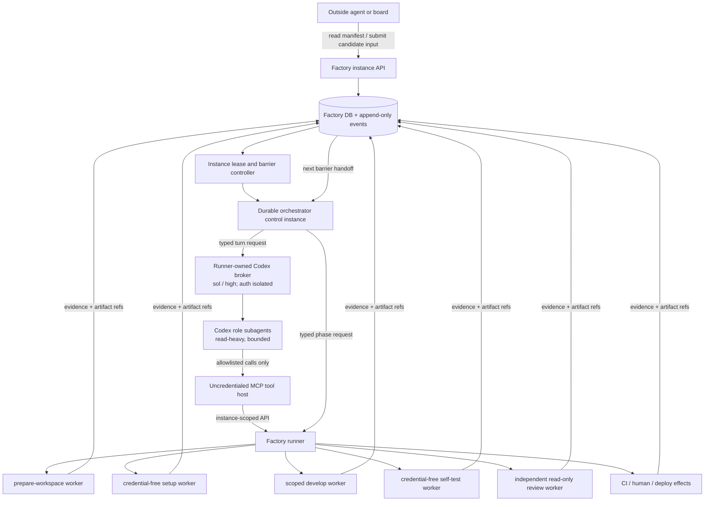

# Durable lineage orchestrator — one Codex control instance from spec through deployment

## 0. Product

The requested operating model is one identifiable orchestrator that follows a change from accepted
specification through deployment, invokes specialized agents for each phase, carries their next-step
handoffs forward, and exposes enough metadata for an outside agent to submit a newly arrived spec or
proposal for possible inclusion.

The recommended implementation is **one durable logical orchestrator instance plus disposable,
capability-scoped phase workers**. The orchestrator is a Codex agent using `sol` with `high` reasoning
by default. `xhigh` is an explicit escalation for ambiguous planning, conflicting late inputs, or
final release synthesis. It is not the default for every turn.

“One instance from spec to deployment” means the same immutable `instance_id`, Codex thread,
container name, persistent orchestration volume, broker-owned Codex state, plan lineage, and event
stream survive the full lifecycle. The control container may be stopped at CI, approval, or
deployment gates and restarted with the same identity. Keeping a process awake while no decision is
possible would spend compute without adding continuity.

It does **not** mean one all-powerful container clones, installs, edits, reviews, pushes, and deploys.
That variant would undo the phase-containment and capability-separation contracts already approved
for Factory. The orchestrator is a control plane; the runner remains the external-effect authority.

## 1. Decision and evaluated options

| Option | Continuity | Containment | Recovery | Decision |
|---|---|---|---|---|
| One container with every checkout, credential, test command, review, and deploy tool | Strong process continuity | Fails: untrusted setup/tests and every credential share one boundary | Container loss risks losing the only live state | Reject |
| Ephemeral orchestrator recreated independently for every phase | Weak; repeated context reconstruction | Good | Easy | Reject: it loses the requested end-to-end owner and encourages duplicate analysis |
| One durable control instance plus scoped phase workers | Strong logical continuity; same thread and lineage | Preserves deny-by-default workers and independent review | Runner DB and append-only events survive container loss | **Adopt** |

The control instance may ask Codex subagents to explore, plan, diagnose tests, summarize review, and
prepare release decisions. Subagents do not gain a different mount or credential merely because
they have a different role. Any action requiring repository writes, untrusted command execution,
GitHub mutation, deployment, or production verification crosses a typed runner boundary and occurs
in the corresponding disposable worker.

This follows the current Codex behavior documented in
[Subagents](https://developers.openai.com/codex/subagents): subagents are useful for parallel
read-heavy work, consume additional tokens, and inherit the parent permission environment unless a
custom agent narrows its sandbox. It also follows the non-interactive automation contract in
[Codex non-interactive mode](https://developers.openai.com/codex/noninteractive): use explicit
sandboxing, JSON events, structured output, and resumable sessions for pipeline work.

## 2. Relationship and prerequisite gate

This spec is `depends-on`, not a replacement for the existing Factory roadmap:

- `2026-08-18-factory-worker-containment-spec` supplies the deny-by-default worker kernel and must
  execute setup, develop, self-test, and review in real phase containers before this orchestrator
  may request those phases.
- `2026-08-18-factory-capability-separation-spec` supplies purpose-scoped, server-derived
  credentials. The orchestrator token is a new control-plane capability, not a renamed broad PAT.
- `2026-08-18-factory-durable-state-outbox-spec` supplies guarded lifecycle transitions,
  append-only events, and restart-safe external effects. This spec extends those mechanisms rather
  than creating another side-effect queue.
- `2026-08-18-factory-topic-capability-manifest-spec` supplies immutable, controller-issued inputs
  and capability claims. Agent prose cannot grant a worker a capability.
- `2026-08-18-factory-orchestration-round7-spec` owns the execution DAG, repo/slice routing, and
  integration joins. This instance coordinates the graph; it does not invent a parallel graph.
- `2026-08-18-factory-orchestration-tests-spec` supplies the first-party Node test harness this work
  extends.
- `2026-08-17-factory-token-budget-governance-spec` remains the global spend authority. A durable
  instance may hibernate; it may not bypass daily, per-run, turn, or retry caps.

Before each slice starts, re-read current `minion-factory/main` and record which prerequisites have
actually landed. A spec status, `possibly_shipped` link, or open PR is not implementation proof.

## 3. AS-IS → TO-BE → DELTA

### 3.1 AS-IS — verified on `minion-factory/main` at `db55476`

1. `runner/src/queue.ts:baseDockerArgs()` still constructs the legacy run container with a GitHub
   token, one Claude credential, the persistent Codex auth home, and output. When memory governance
   is off it also includes the legacy memory mounts; governed runs omit those mounts. Either way, a
   dev run can carry several credential/capability surfaces in one container.
2. `runner/src/containers.ts` already defines a strong deny-by-default phase-policy kernel for
   `prepare-workspace`, `setup`, `develop`, `self-test`, `prepare-review`, and `review`. It fixes
   mounts, credential purposes, environment names, network modes, resource limits, and entrypoints.
3. Live phase execution is not implemented. `beginRun()` refuses a dev run when
   `FACTORY_CONTAINMENT_V2=1`, preventing an operator from believing the legacy path is contained.
4. `runner/src/db.ts` already has durable `phase_attempts` and a stateful `phase_effects` ledger.
   Tests exercise crashes between phases and around GitHub effects, but the production queue does
   not yet drive the full phase sequence through those records.
5. A Factory run has no durable orchestrator identity, Codex thread id, plan revision, input-set
   hash, late-input decision record, phase handoff record, or outside-readable instance manifest.
6. Current Codex stages in `agent/run.sh` and `agent/spec.sh` are isolated `codex exec` calls. They do
   not preserve one parent thread from spec through deployment or expose typed subagent handoffs to
   the runner.
7. Current provider configuration already maps the high Codex tier to `sol` with `high` reasoning,
   but there is no per-instance `xhigh` escalation record or rule.
8. The run and daily budget gates stop spend, but a killed monolithic container can discard useful
   progress and force a later run to reconstruct it. Issue `minion-meta#124` is current evidence: a
   healthy multi-round run reached a second review and was killed at the 50-minute wall-clock cap.

### 3.2 TO-BE — target behavior and invariants

1. One `pipeline_instance` is admitted from an immutable spec/proposal snapshot. The runner stores
   its root input hashes, resolved execution/manifest hashes, current plan revision, Codex thread id,
   current phase, candidate commit, and deployment evidence.
2. The same instance survives every phase and restart. The container is replaceable; the runner DB,
   content-addressed artifacts, and append-only event stream are authoritative.
3. The orchestrator receives one instance-scoped runner control token and **no provider
   credential**. A runner-owned Codex broker holds the auth and per-instance Codex state outside the
   control container, exposes only a turn/stream interface, and runs Codex with no generic
   shell/process/filesystem tools—only the allowlisted instance MCP surface. The control container
   also receives no GitHub token, Docker socket, SSH key, deployment credential, production database
   credential, writable target checkout, or shared writable dependency cache.
4. The orchestrator delegates cognition to named Codex roles and requests effects through typed
   runner tools. The runner validates phase, plan revision, input-set hash, candidate SHA,
   capability manifest, budget, and idempotency key before launching a worker.
5. Setup and self-test execute without model or GitHub credentials. Develop receives only its
   branch-write and selected-model surfaces. Review receives exactly one model surface, a read-only
   exact-SHA checkout, no GitHub credential, and no writable develop output. Deployment remains a
   runner/operator effect after required CI and human gates.
6. Every phase returns a structured handoff. A later agent receives only the accepted plan revision,
   immutable artifact references, prior evidence summaries, allowed actions, and stopping
   condition—not an unbounded transcript dump.
7. Outside agents can read a secret-free manifest and submit a candidate input. They cannot edit the
   container, mutate the plan, or inject a new instruction directly into an active Codex turn.
8. A late input is folded only at a durable barrier under the policy in §7. Accepted folds create a
   new plan revision and input-set hash; deferred/rejected inputs remain visible and immutable.
9. `sol/high` is the parent default. `xhigh` is used only when a typed escalation reason is recorded.
   Read-heavy bounded subagents default to a cheaper role model where quality is sufficient.
10. Independent review stays provider-independent. A Sol/Terra/Luna child is not an independent
    reviewer of a Sol parent merely because it is a separate thread.
11. The instance may hibernate while waiting for CI, human approval, a dependency, or deployment
    authorization. Hibernation closes active model turns, transactionally releases the writer
    lease, and stops the control container while preserving its thread, volumes, and metadata.
    Resume acquires a fresh lease by CAS before any new turn.
12. No state transition depends on an agent saying it succeeded. CI, GitHub, runner workers, and
    deployment probes produce controller-observed evidence.

### 3.3 DELTA — transitions, slices, and proof

| # | Transition | Slice | Proving evidence |
|---|---|---|---|
| D1 | Runs gain a durable lineage instance, immutable inputs, revisions, turns, handoffs, and outside-readable manifest. | S1 | Fresh/upgrade DB tests, API authorization tests, hash/idempotency fixtures. |
| D2 | Independent Codex calls become one resumable Sol parent thread with bounded structured turns through a credential-isolated broker. | S2 | A transport spike proves thread resume and OS-level auth/tool separation before the chosen adapter is admitted. |
| D3 | A continuously running process becomes a restartable/hibernatable container identity whose state is not authoritative. | S3 | Crash/restart and stop/start tests preserve lineage and do not repeat a completed effect. |
| D4 | Free-form delegation becomes named roles plus a versioned phase-handoff schema. | S4 | Role/sandbox tests and schema fixtures reject missing revision, SHA, permissions, or stop condition. |
| D5 | New specs/proposals discovered mid-run become immutable candidate inputs with deterministic fold/defer/block decisions. | S5 | Barrier/race tests prove no input mutates an active turn or silently changes scope. |
| D6 | The parent container performing work becomes runner-launched scoped phase workers bound to existing phase policy. | S6 | Adversarial mount/credential tests and a real phase sequence under `FACTORY_CONTAINMENT_V2=1`. |
| D7 | Review/deploy instructions become provider-independent evidence gates and exactly-once release effects. | S7 | Same-provider review refusal, stale-head refusal, CI/human gate, deploy reconcile, and rollback tests. |
| D8 | A monolithic experimental cutover becomes shadowed, budgeted, canaried rollout with instant admission rollback. | S8 | Full fixture E2E and one operator-observed canary from accepted spec to verified deployment. |

## 4. Runtime architecture



Only the runner owns Docker, provider auth, and external-effect credentials. The orchestrator and
its brokered Codex turn see typed tools such as `request_phase`, `read_artifact`, `record_decision`,
and `hibernate`, backed by the instance API or a local stdio MCP adapter. There is no Docker socket,
generic shell/process tool, provider auth file, or provider key inside the control container. The
credentialed broker receives no repository checkout or outside-writable file mount.

Slice 2 is a mandatory transport and security spike, not a predetermined CLI implementation. The
preferred candidate is the TypeScript Codex SDK because the official SDK documentation supports
starting, continuing, and resuming threads and recommends the SDK for CI/CD and other automation.
When Codex is a specialist inside a broader workflow, the same documentation recommends exposing
Codex as an MCP server and orchestrating it with the Agents SDK. A pinned `codex exec --json` adapter
is only a compatibility candidate; it is not production-admissible until it proves the same thread,
schema, model/reasoning, and OS-level auth/tool isolation properties. Codex App Server WebSocket is
excluded because its documentation labels that transport experimental and unsupported for
production.

Whichever supported transport wins, the credentialed broker supervisor and the model-invoked tool
host are separate security principals. Provider authentication exists only in the supervisor. All
tool execution—including native Codex subagent work—must cross into an uncredentialed process or
container that exposes only the versioned instance MCP allowlist. If no supported transport can
prove that a prompt-injected model or child agent cannot read the supervisor environment, auth
files, or process state, S2 stops and the architecture does not enter production.

## 5. Durable data contracts

### 5.1 `pipeline_instances`

Required fields:

| Field | Contract |
|---|---|
| `id` | Opaque stable id; never derived from mutable title text. |
| `repo_id` | One canonical Factory registry id. |
| `root_input_kind`, `root_input_id`, `root_input_sha` | Immutable admitted source. |
| `execution_id`, `execution_key`, `manifest_hash` | Existing graph/manifest binding when available; `execution_key` is a non-null normalized id (`execution_id` or the literal `no-execution`). |
| `status` | `admitted|planning|developing|testing|reviewing|awaiting-ci|awaiting-approval|deploying|verifying|completed|attention-required|canceled`. |
| `runtime_state` | `absent|starting|running|stopping|stopped|lost`; does not replace lifecycle status. |
| `current_phase` | Current graph/worker phase or durable barrier. |
| `plan_revision` | Positive integer, starts at 1, increments only after an accepted fold or explicit human revision. |
| `input_set_hash` | Canonical hash over ordered accepted input identities and content hashes. |
| `orchestrator_harness`, `orchestrator_model`, `reasoning_effort` | Initially `codex`, `sol`, `high|xhigh`. |
| `codex_thread_id` | Captured from Codex JSON events; nullable only before the first turn. |
| `container_name`, `volume_ref`, `codex_state_ref` | Runner-derived opaque identifiers; the broker-owned Codex state is never mounted into the control container or publicly projected. |
| `candidate_sha`, `deployment_ref` | Controller-observed pointers, nullable until available. |
| `lease_owner`, `lease_expires_at`, `last_heartbeat_at` | Single-writer lease; a lost container cannot keep acting. |
| `created_at`, `updated_at`, `completed_at` | UTC timestamps. |

SQLite enforces one active lineage with a partial unique index over
`(repo_id, root_input_kind, root_input_id, root_input_sha, execution_key)` where status is not
`completed` or `canceled`. `execution_key` is always non-null, so pre-graph admissions cannot bypass
the index through SQLite's multiple-`NULL` behavior. Repeated admission returns the existing
instance rather than spawning another parent.

### 5.2 `pipeline_inputs`

Each outside or discovered input is append-only:

```text
id, instance_id, kind, source_id, source_sha,
relation, state, received_at, decided_at,
decision_reason, resulting_plan_revision
```

- `kind`: `spec|proposal|issue|comment|operator-directive`.
- `relation`: `folds|extends|supersedes|blocks|observes|unknown`.
- `state`: `pending|accepted|deferred|rejected`.
- `(instance_id, kind, source_id, source_sha)` is unique.
- Original content is stored by content hash or immutable source URL, never rewritten in place.

### 5.3 `orchestrator_turns` and `phase_handoffs`

`orchestrator_turns` records thread id, plan revision, purpose, requested model/effort, start/end,
exit class, token/turn counters when available, output artifact, and escalation reason. It does not
store secrets or an unbounded raw transcript in the public manifest.

`phase_handoffs` records:

```json
{
  "schemaVersion": 1,
  "instanceId": "...",
  "planRevision": 3,
  "inputSetHash": "sha256:...",
  "phase": "self-test",
  "candidateSha": "...",
  "status": "passed",
  "summary": "bounded plain text",
  "evidence": [{ "kind": "test-report", "ref": "artifact:...", "sha256": "..." }],
  "next": [{ "phase": "review", "reason": "all required tests passed" }],
  "blockedBy": [],
  "stopCondition": "await controller admission of review"
}
```

The runner stamps identity, phase, revision, hashes, and candidate SHA. Model output cannot supply
or override those fields.

### 5.4 Secret-free outside manifest

`GET /instances/:id/manifest` projects a bounded document:

```json
{
  "schemaVersion": 1,
  "instanceId": "pi_...",
  "repoId": "minion-hub",
  "rootInput": { "kind": "spec", "id": "...", "sha": "..." },
  "status": "reviewing",
  "runtimeState": "stopped",
  "currentPhase": "awaiting-ci",
  "planRevision": 3,
  "inputSetHash": "sha256:...",
  "candidateSha": "...",
  "acceptedInputs": [{ "kind": "proposal", "id": "...", "sha": "...", "revision": 3 }],
  "pendingInputs": [],
  "latestHandoffRef": "artifact:...",
  "updatedAt": "..."
}
```

No prompt, credential, environment value, local host path, auth-home path, private log body, or
deployment secret appears in this projection.

## 6. API and authorization

Initial endpoints:

- `POST /instances` — operator/admission controller only; immutable root input and idempotency key.
- `GET /instances` and `GET /instances/:id/manifest` — instance-read capability; bounded filters.
- `POST /instances/:id/inputs` — instance-intake capability; accepts immutable source identity,
  hash, relation claim, and content reference. The server marks it `pending`; the caller cannot mark
  it accepted.
- `POST /instances/:id/phase-requests` — orchestrator capability for this instance only. The server
  derives actor and validates the typed request against current state.
- `POST /instances/:id/decisions` — orchestrator may record advisory decisions; human-required
  decisions require an operator capability and server-derived actor.
- `POST /instances/:id/hibernate|resume|cancel` — operator/controller capabilities. Cancel is
  terminal; hibernate is not.

Tokens are opaque, short-lived, hashed at rest, and scoped by instance plus verb. The orchestrator
cannot list another instance unless separately authorized. Request bodies never accept a `by` or
credential field.

## 7. Input folding policy

Outside agents submit candidates; they do not edit an active plan. The controller evaluates at the
next barrier:

| Arrival point | Default action | Exception |
|---|---|---|
| Before develop starts | Run impact analysis; compatible approved input may fold into a new plan revision. | Conflicting or ambiguous input waits for human decision. |
| During develop or self-test | Record immediately, pause at the next durable barrier, compare scope/files/acceptance, then fold or defer. | A verified safety blocker may stop the active worker. |
| During independent review or CI | Defer to a follow-up lineage by default. | A superseding approved spec or safety blocker pauses release and requires fresh affected phases. |
| During deploy or post-deploy verification | Never mutate the deploying candidate. | Safety blocker invokes the existing stop/rollback path; new scope becomes a new instance. |
| After completion | Create a related successor instance. | None; completed history is immutable. |

An accepted fold must:

1. resolve the source at an immutable SHA;
2. classify relation and affected graph nodes;
3. prove no acceptance criterion is lost;
4. increment `plan_revision` and recompute `input_set_hash` in one transaction;
5. invalidate only affected, nonterminal evidence;
6. emit `input.accepted` and `plan.revised` events;
7. start a new Codex turn at the barrier using the new revision.

A proposal is advisory until approved under existing lifecycle rules. It cannot silently change an
accepted spec. A comment or issue can block for safety, but cannot add feature scope without human
promotion.

## 8. Codex model and delegation policy

### Parent

- Harness: `codex`.
- Model: `sol`.
- Default reasoning: `high`.
- `xhigh` is allowed only with one of: `initial-plan-ambiguity`, `input-conflict`,
  `cross-repo-integration`, `release-risk-synthesis`, or explicit operator request.
- Each turn has a typed purpose, bounded context manifest, output schema, wall/turn budget, and one
  recorded result. A malformed result is an error; it is not converted to an empty success.

### Child roles

Project-local custom role files under `.codex/agents/` define at least:

| Role | Default | Work | Boundary |
|---|---|---|---|
| `spec-analyst` | Terra, high | Read accepted inputs; identify ambiguity and acceptance gaps. | Read-only; no effect requests. |
| `repo-explorer` | Terra, medium | Locate impact surfaces and tests. | Read-only snapshot. |
| `implementation-planner` | Sol, high | Produce phase requests and handoff expectations. | No direct checkout write or GitHub access. |
| `test-diagnostician` | Terra, medium | Interpret bounded test artifacts and propose next test/fix phase. | Cannot rerun or waive a gate itself. |
| `review-coordinator` | Sol, high | Reconcile independent-review findings with the plan. | Cannot act as the independent reviewer. |
| `release-verifier` | Sol, high | Check evidence completeness and produce a release recommendation. | Cannot deploy or mark verification passed. |

Maximum concurrent Codex child threads starts at three. Parallelism is for independent read-heavy
work; phase requests that may lead to writes are serialized by node/workspace. Every child returns a
small JSON result to the parent. Raw subagent transcripts remain private artifacts with retention
limits, not input to every later turn.

### Independent reviewer

The reviewer must have a different `independence_group` from the implementer/orchestrator for work
whose profile requires independence. Another Codex model or OpenRouter route to an OpenAI-hosted
model is the same group. The runner supplies a Claude or other approved independent provider in the
read-only review phase and records the resolved provider origin, not merely the aggregator name.

## 9. Security and failure boundaries

1. No provider auth, Docker socket, host network mode, SSH material, GitHub write token, deploy
   token, or production credential in the control container.
2. No target repository writable mount. The control volume contains only bounded orchestration
   checkpoints, handoff references, and server-issued metadata; Codex state remains broker-owned.
3. Untrusted repository setup/tests never execute in the orchestrator. They run in credential-free
   phase workers under registry-declared commands and network policy.
4. The runner-owned Codex broker supervisor is the only surface that receives Codex authentication.
   It stores provider auth and per-instance thread/session files in a broker-owned volume that the
   control container, uncredentialed tool host, outside input sources, and phase workers cannot
   mount or read. Model-invoked tools and native Codex subagents execute through that separate tool
   host, which has no generic shell/process/filesystem escape and cannot recursively invoke another
   Codex process; it can call only the versioned instance MCP allowlist. Initially one broker turn
   may use the operator-owned ChatGPT auth home at a time; concurrency requires a reviewed
   per-instance auth-copy/refresh strategy.
5. The instance token can request only legal transitions for its own id. The runner independently
   resolves every mount, env name, repo, phase, and capability.
6. A lost heartbeat expires the lease. Planned hibernation first releases it transactionally;
   restart or resume acquires a new lease by CAS, marks any unexpectedly active turn interrupted,
   reconciles pending effects, and resumes only from the last confirmed barrier.
7. `codex_thread_id` is continuity metadata, not authority. If resume fails, a replacement thread
   may be created from the durable manifest and event summaries, with `thread.replaced` recorded.
8. Model output is untrusted. Every structured output is schema-validated, length-bounded, and
   neutralized before entering a later prompt or external artifact. Adversarial tests include an
   outside input asking for auth contents, a schema-valid field carrying credential-shaped text, and
   a request to spawn nested Codex; none may expose auth or create an untracked model turn.
9. CI, review, approval, deployment, and verification gates fail closed on missing, stale, or
   mismatched evidence.

## 10. Implementation slices

### Slice 1 — Instance schema, immutable input ledger, and read API (minion-factory, 6–8h)

**Topics:** `logic`, `infra`, `test`

**Files:** `runner/src/db.ts`; new `runner/src/instances.ts`; new
`runner/src/instances.test.ts`; `runner/src/index.ts`; focused route tests.

- Add `pipeline_instances`, `pipeline_inputs`, `pipeline_events`, `orchestrator_turns`, and
  `phase_handoffs` through fresh-table DDL plus additive upgrade migration.
- Implement canonical input-set hashing, non-null `execution_key`, the partial active-lineage unique
  index defined in §5.1, append-only event sequencing, server-derived actor, and bounded manifest
  projection.
- Add `POST /instances`, `GET /instances`, `GET /instances/:id/manifest`, and candidate-input intake
  with separate capabilities. Do not add start/resume or a container in this slice.
- Link existing `runs`, `phase_attempts`, and `phase_effects` by nullable `instance_id` and
  `plan_revision`; legacy rows remain valid.

**Machine-checkable DoD:** fresh/upgrade DB tests; concurrent duplicate admission with and without
an `execution_id` returns one instance; the partial index admits a successor only after terminal
status; input replay is idempotent; event sequence is monotonic; unauthorized cross-instance
reads/writes return 401/403; manifest fixture contains no secret/path/log fields; `npm test` and
`npm run typecheck` pass.

### Slice 2 — Credential-isolated Codex broker and resumable turn adapter (minion-factory, 6–10h)

**Topics:** `logic`, `infra`, `test`

**Files:** new `runner/src/codex-orchestrator.ts`; new broker policy/launcher; schemas under
`runner/src/schemas/`; focused tests; broker and uncredentialed tool-host image definitions with
pinned runtime versions.

- Spike the TypeScript Codex SDK, Codex-as-MCP plus Agents SDK, and pinned CLI adapter against one
  acceptance harness. A production candidate must support explicit Sol model/reasoning, first turn
  plus resume, structured events/final schema, custom roles or equivalent bounded delegation,
  instance-only MCP tools, usage capture, cancellation, and deterministic error reporting.
- Prove OS-level separation: the broker supervisor owns provider auth and per-instance Codex state
  but receives no repository checkout; every model-invoked tool and native subagent call executes in
  a separate uncredentialed tool host. The auth principal exposes no generic shell, process, or
  filesystem tool. Reject every candidate transport that cannot prove these properties.
- Record the selected transport and pinned versions in a decision artifact. Keep `codex exec --json`
  only as a fake/compatibility fixture unless it passes the same acceptance and adversarial suite.
- Resume only the stored thread id. Bind each turn to instance id, lease, plan revision, input-set
  hash, purpose, and idempotency key.
- Persist the turn before spawn, mark interrupted on process loss, and accept a final result only if
  its runner-stamped envelope still matches the current revision/hash.
- Implement the closed `xhigh` escalation reasons in §8; no model may self-escalate.

**Machine-checkable DoD:** the common transport harness covers first turn, resume, malformed event
stream, malformed final JSON, wrong thread, timeout, process crash, stale revision, and one legal/one
illegal xhigh request. Exact replay creates no second accepted turn. Namespace/container tests prove
auth and Codex state appear only in the broker supervisor and are absent from `/proc`, env, mounts,
and tool responses visible to the uncredentialed host. Prompt-injection fixtures cannot read auth,
emit a credential in a schema-valid field, invoke a shell, recursively launch Codex, or make a tool
call outside the instance allowlist. A real pinned-runtime smoke test must pass; otherwise S2 is a
documented blocker and no production instance is admitted.

### Slice 3 — Orchestrator container identity, lease, restart, and hibernation (minion-factory, 6–8h)

**Topics:** `infra`, `security`, `logic`, `test`

**Files:** new `runner/src/orchestrator-container.ts`; `runner/src/containers.ts`; queue/boot wiring;
image entrypoint; focused adversarial tests.

- Add a control-plane policy distinct from worker phases. It allows only the control volume,
  per-turn input/output leaves, and the instance API/stdio adapter. Codex auth and state are broker
  mounts and are forbidden from this policy.
- Derive container/volume names from the instance id. Use a read-only root filesystem, non-root
  user, bounded memory/CPU/PIDs, no Docker socket, and no target checkout/cache/memory database.
- Acquire/renew a single-writer lease; start/resume only after CAS. Hibernation transactionally
  records `runtime_state=stopped`, releases the lease, and only then stops the container. Resume
  acquires a fresh lease by CAS and uses the same control and broker-state references. Container
  deletion alone does not delete instance history.
- Add exact-opt-in `FACTORY_LINEAGE_ORCHESTRATOR_V1=1`; unset or malformed values leave legacy
  admission unchanged.

**Machine-checkable DoD:** rendered control argv has no secret values, auth mounts, or forbidden
mount/env; a concurrent starter loses the lease; crash at every turn boundary resumes once;
hibernation holds no lease and uses no active container, then resume reacquires by CAS and continues
the same thread; auth/controller outage yields `attention-required`, not legacy fallback.

### Slice 4 — Named child roles and typed handoffs (minion-factory, 6–8h)

**Topics:** `logic`, `test`, `security`

**Files:** `.codex/agents/*.toml`; versioned JSON schemas; new handoff validator and tests;
orchestrator prompt assembly.

- Add the six roles in §8 with the least sandbox and explicit output schema.
- Define the v1 handoff/request envelopes. Runner-stamp identity/revision/SHA fields and cap summary,
  evidence, next-step, and blocker lengths/counts.
- Limit concurrency to three and serialize any node that can cause a write. Close child threads at
  each barrier after their result is incorporated.
- Reject direct claims of CI, review, merge, deployment, or production success without a
  controller-owned evidence reference.

**Machine-checkable DoD:** every role loads under the pinned Codex CLI; role fixtures cannot request
undeclared effects; malformed/oversized handoffs fail; conflicting write requests serialize; raw
transcripts do not appear in the next-turn prompt or public manifest.

### Slice 5 — Late-input intake, barrier impact analysis, and plan revision (minion-factory, 6–8h)

**Topics:** `logic`, `infra`, `test`

**Files:** `runner/src/instances.ts`; new `runner/src/input-folding.ts`; lifecycle/relationship
adapters; focused tests.

- Implement §7 as a pure decision table plus guarded transaction. Outside relation claims remain
  advisory until resolved against current artifacts and lifecycle state.
- Wake a hibernated instance when a pending input arrives, but inject it only into a new barrier
  turn. Never alter a running Codex prompt or worker environment.
- Accepted folds create one new plan revision/hash and mark affected evidence stale. Deferred and
  rejected items remain projected with reason.
- A completed instance creates a successor relation rather than reopening history.

**Machine-checkable DoD:** fixtures cover every arrival row in §7, duplicate delivery, stale source
SHA, concurrent phase completion, acceptance-loss refusal, human-required proposal, safety blocker,
and completed-lineage successor. No race produces a half-revised plan.

### Slice 6 — Scoped worker bridge and real phase execution (minion-factory, 8h)

**Topics:** `security`, `infra`, `logic`, `test`

**Prerequisite:** worker-containment and capability-separation are implemented, verified, and
enabled in shadow. If `CONTAINMENT_IMPLEMENTED_PHASES` is incomplete, this slice is blocked.

**Files:** queue phase driver; `runner/src/containers.ts`; phase entrypoints; phase-attempt/effect
integration; worker tests.

- Map each accepted phase request to one existing phase-policy plan. The orchestrator supplies no
  raw Docker flags, paths, env names, commands, or credentials.
- Execute prepare-workspace → setup → develop → self-test → prepare-review → review using durable
  attempts and effects. Preserve exact candidate SHA between prepare-review and review.
- Publish only validated evidence/handoffs back to the instance. The parent cannot read auth homes
  or worker-private writable output.
- Keep legacy dev admission available while shadowing, but never fall back for an admitted v1
  instance.

**Machine-checkable DoD:** existing adversarial container tests stay green; new end-to-end fake
remote proves crash/restart between every phase, exact-once PR/push/comment/readiness effects,
credential absence by phase, read-only review SHA, and no legacy fallback.

### Slice 7 — Independent review, CI, release, deploy, and verification gates (minion-factory, 6–8h)

**Topics:** `security`, `infra`, `logic`, `test`

**Files:** instance controller; review/provider policy; automerge/release adapters; deployment effect
adapter; focused tests.

- Require a provider-origin independence group for profiles that require independent review.
- Handoff to CI after an attested reviewed candidate; hibernate while checks or approval are
  pending. Wake from webhook/poll events, not model polling.
- Treat merge, deployment, and verification as durable effects with idempotency and remote
  reconciliation. The orchestrator recommends; controller/operator gates authorize.
- Bind verification to deployment ref and candidate SHA. A green source UI or webhook alone is not
  deployment proof.

**Machine-checkable DoD:** same-group review, stale review SHA, missing required check, missing human
approval, ambiguous remote effect, and mismatched deployment ref all fail closed. Restart cannot
double-merge or double-deploy.

### Slice 8 — Shadow comparison, canary, observability, and rollout (minion-factory, 4–6h)

**Topics:** `infra`, `test`, `security`

**Files:** metrics/stats; operator docs; deployment config; fixture E2E.

- Shadow instances generate plans/requests without launching workers; compare them with current
  routing, budgets, and expected phase order.
- Record active/hibernated duration, parent/child turns, retries, phase wall time, duplicate work
  avoided, fold decisions, and terminal reason. Do not infer dollar cost for subscription Codex.
- Canary one low-risk single-repo spec with auto-merge/deploy disabled, then one full human-approved
  deployment. Expand only after zero containment/lineage violations.
- Add `FACTORY_LINEAGE_ORCHESTRATOR_ADMISSION_V1=1` separately from shadow. Turning admission off
  blocks new instances but continues already-admitted effects/recovery.

**Machine-checkable DoD:** the §12 E2E passes; shadow divergence is explainable; budget/timeout stop
produces a resumable barrier rather than discarded progress; flag rollback leaves no orphaned active
lease or unresolved effect.

## 11. Rollout and implementation order

1. Land the immediate merge-scan structured-output fix first; it prevents known repeated paid work
   and is independent of this architecture.
2. Finish and verify durable state/outbox, capability separation, and real worker containment.
3. Land S1–S5 behind the shadow flag. These establish durable lineage, Codex continuity, metadata,
   and folding without granting execution authority.
4. Land S6 only after containment readiness is true. Run fixture and adversarial tests before any
   production admission.
5. Land S7 release gates and prove hibernation/wakeup around hosted CI and human approval.
6. Run S8 shadow, then a no-auto-merge canary, then one human-approved deployment.
7. Keep the legacy runner available during observation, but never switch an already-admitted
   lineage instance to legacy after an error.

The CI-compute/Bun/OpenRouter work is tracked separately so a test-runner experiment cannot delay or
silently weaken this security boundary.

## 12. End-to-end verification

With production credentials represented by scoped test doubles first, then one operator-approved
canary:

1. Admit an approved, commit-pinned, low-risk single-repo spec. Confirm one instance, one root input,
   plan revision 1, `sol/high`, a captured Codex thread id, and a secret-free public manifest.
2. Hibernate the orchestrator after planning. Confirm no running control/broker container or CPU
   consumer and no held lease; resume it, reacquire by CAS, and confirm the same instance, volumes,
   thread, revision, and input hash continue.
3. Let it request prepare/setup/develop/self-test. Confirm each worker receives only its phase policy
   and a crash between every adjacent phase resumes once without duplicate external effects.
4. During self-test, submit a compatible approved proposal from an outside-agent token. Confirm it
   appears pending immediately, is considered only at the next barrier, becomes revision 2 exactly
   once, and invalidates only affected evidence.
5. Submit an unapproved feature proposal during review. Confirm it is deferred and cannot alter the
   candidate under review.
6. Confirm the independent reviewer has a different provider-origin group, read-only exact-SHA
   checkout, and no GitHub credential. The reviewed SHA must equal the candidate admitted to CI.
7. Hibernate while CI and human approval are pending. Wake from controller evidence; do not spend
   model turns polling.
8. Authorize deployment once. Simulate a runner crash after the remote accepted the deploy but
   before confirmation; restart must reconcile and record one deployment effect.
9. Verify the deployed ref and production probe, mark completed, and reject any attempt to fold a
   late input into that immutable history. The late input becomes a successor instance.
10. Disable admission. Existing reconciliation completes; no new v1 instance starts; no instance
    falls back to the legacy credential-rich container.

## 13. Out of scope

- Giving the orchestrator a Docker socket or direct deployment credentials.
- Treating internal Codex subagents as provider-independent reviewers.
- Parallel write-heavy subagents in one checkout.
- Continuous uptime while the instance is waiting on external state.
- Auto-accepting an unapproved proposal or mutating a completed lineage.
- Replacing the execution DAG, phase-policy kernel, durable effect ledger, or global budget gates.
- Bun test migration, Vitest replacement, and OpenRouter provider addition; see the companion
  compute-savings roadmap.
- Production reliance on experimental Codex App Server WebSocket transport.
- Mounting provider auth or broker-owned Codex state into the durable control container.
